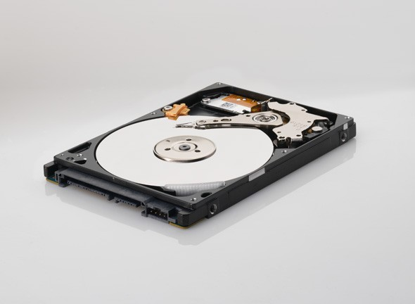

Seagate Momentus XT Hybrid Drive

My friend Dale picked up a [Seagate Momentus XT 7200 RPM hybrid drive](http://www.seagate.com/www/en-us/products/laptops/laptop-hdd) not that long ago and put it in his Macbook Pro. Shortly thereafter he was raving about how fast it was, so I decided it would be a good idea to put one in my computer as well. Dale brought one down to Mexico, but unfortunately neither of us had a Torx screwdriver to change out the one on my computer. So I took it home with me and did the surgery on my computer a few days ago.

For those of you that don’t know, a hybrid drive is a cross between a normal hard drive and a solid state drive. While hard drives are fairly slow (and cheap), solid state drives are super fast (but really expensive). A hybrid drive fits in the middle and offers really fast speeds for a reasonable price. It does this by coupling a small solid state component in front of a normal hard drive, effectively acting like a really large cache in the front of the drive.

When you write to the drive it gets written immediately to the solid state component, so it seems quick (the drive later writes it to the hard drive when it is idle). Whenever a read occurs the drive uses an intelligent algorithm to decide what data to leave on the solid state component. If a subsequent read comes it and it’s on the solid state part of the drive, the read is nearly instantaneous.

I didn’t do any quantifiable tests before putting the new drive in, but without a doubt it’s a lot snappier. I’d estimate that my boot time has been reduced by 30% – 40%, and applications open a lot faster now. Having seen a real solid state drive in a Macbook Pro before, it’s definitely not that fast, but in a lot of scenarios it comes fairly close. But given that a hybrid drive is only a fraction of the cost as a pure solid-state drive, it’s definitely a great option for people who want more speed but don’t want to break the bank.