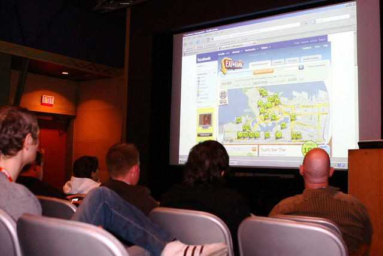

I recently caught wind of this video showing a professor scolding [nearly 200 students for “cheating”](http://abcnews.go.com/Business/widespread-cheating-scandal-prompts-florida-professor-issues-ultimatum/story?id=11737137) on a university midterm. The problem is, after watching the video, is that I fail to see how this is cheating at all.

What appears to have happened is that the university professor, most likely out of laziness in my opinion, generated a midterm exam using a test bank, which is a database of test questions. Since it is likely that these questions were also on many of the previous year’s midterm exams, students that studied from old material had a distinct advantage over students who hadn’t studied from that material.

The problem is that many students use previous test material as a way to study. I know personally the way I prepared for any midterm and final exam was to attempt to solve and answer every question I could get my hands on – that way I was reasonably prepared to answer any question that came up.

Learning is a one-way process. Unless you’re afflicted with some type of memory loss, you generally can’t “unlearn” material you’ve already encountered. So when presented with questions you’ve encountered before, what do you do? Purposefully get them wrong, or pat yourself on the back for studying more material than some of your peers?

At the University of British Columbia not only do students often study from previous exams, but the associated student clubs also make money off of selling previous exams to students in study packs. So not only is this an accepted practice, but it’s encouraged by the student clubs.

I actually just sent an email to the professor in that video expressing my disagreement with how he portrayed those students. The question I posed to him was the following. Since the same course material is taught by different professors, how are students supposed to reasonably remove the obvious bias that comes from different professors testing course material by generating their own unique questions for the exam? It’s simple – you study previous exams given by the same professor to get a feel for how each professor tests the knowledge for that class.

In my opinion, these students are being vilified because they studied from previous exam material and the professor was too lazy to come up with his own test. That’s the bottom line. If I were the students in that class I would protest to the administration and the dean. If a professor getting paid six figures can’t spend a bit of time putting together a unique test for his class, he shouldn’t blame the students for when they ace it due to having studied from previous tests.