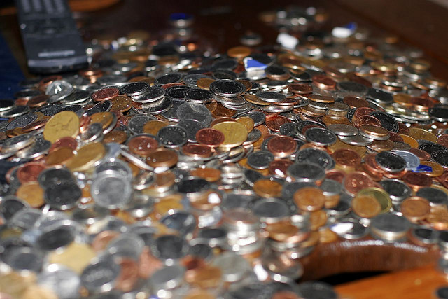

So, looks like Ireland is now in a bit of financial trouble. First, we had Greece. Next, we had some trouble in Spain. And now it looks like Ireland might be in for a world of hurt.

If we go back a few years we can also find a few more countries in distress. Argentina had its currency nearly collapse in the early 2000s, and Zimbabwe went through a massive period of hyperinflation this last decade.

Last night, right before bed, it looked like North Korea just launched a small attack on South Korea – so things aren’t looking very good on a global scale.

I haven’t blogged about finances or the markets in quite some time, mainly because nothing really has changed fundamentally until recently. It started not that long ago when Helicopter Ben Bernanke did his second round of Quantitative Easing (aka printing money), which injected another $600 billion dollars worth of liquidity into the system (i.e. he kicked a $600 billion dollar can down the road). If you believe in Keynesian Economics, Santa Claus or the Tooth Fairy, then this injection will create jobs and help stimulate a faltering economy. If you believe in the Austrian school of economic thought, then printing this money is only causing the further devaluation of the US dollar and erosion of purchasing power for most Americans.

I read a book not that long ago called The Second Great Depression. The book was written a few years ago, and proposed six different scenarios that could result in a second, more dramatic great depression if they were to occur. One of the more dramatic triggers for the event involved the collapse of the US Dollar, but the author thought it was one of the most unlikely scenarios. That is, according to the author, unless the price of gold approached $1500 by the end of 2010, which it has unfortunately (for the doomsday scenario) done. That, the author said, would be the canary in the coal mine for the proposed doomsday scenario which ultimately results in the collapse of the US Dollar.

The current price of gold is around $1310/ounce, down from a high of around $1370. I think many people (myself included) are cashing out right now, but that there’s a second wave of growth coming soon. The recent injection by Helicopter Ben will translate into more price inflation about a year from now, and that’s only going to drive more and more investors to the safe haven of gold. So, watch and see if we hit $1,500 in the next few months.

If so, it might be a good time to start stocking up on canned goods and jugs of water.