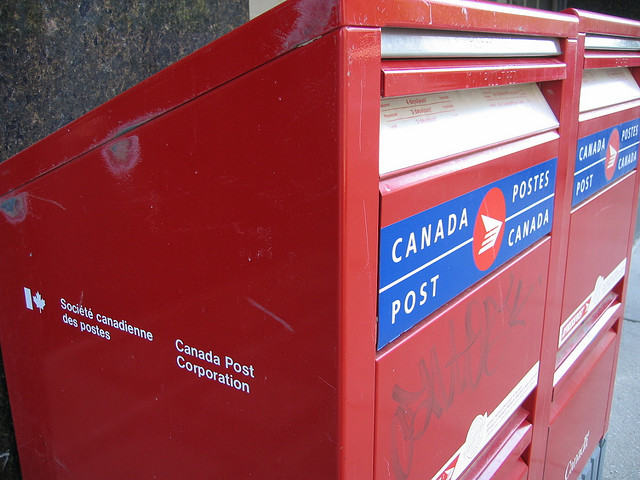

Mailbox, Photo By Dulcie on Flickr

One of the obvious problems with going away for a whole year is figuring out what to do with your mail. While many services and companies these days offer paperless options, many still do not. I know first hand that if your VISA bill gets returned to sender, the very first thing the VISA company will do is put a hold on your card until you get a proper address again. So it’s important to have your mail end up somewhere.

I briefly debated asking someone in my family to look after all my mail for me. The idea there would be to simply use one of their house addresses as my address, and have them toss my paperwork into a box. The main reason I opted against that option is because I really don’t want to inconvenience anyone by having to look after my mail for a year. Also, I can imagine a few scenarios where I’d need some mail scanned or emailed to me, and I don’t really want to have to bother anyone to find a scanner and sort all of that out.

That left me with only one real option: professional mail services. There are a few companies in Vancouver I briefly considered using. Most of them offer similar services – they’ll give you an address to use at their facility, accept mail for you, and possibly scan or email certain items to you for a small fee. Unfortunately most of the prices I encountered were around the $30 – $50 a month range, which is simply too much to pay as a personal user.

Not long ago I swung by the local UPS store here in Chilliwack to obtain some packing supplies, and saw that they also offer mailbox services. Their standard rate is $140/year, which gives you a dedicated address to use for your mail. One thing they do which I like is to periodically clean your box out and store everything in the back, that way the box doesn’t fill up. They also offer value-add services such as the ability to scan and email various letters simply by calling or emailing them.

Because they had a special going on, I managed to get an extra three months for free. So that means I paid about $150 (which includes the $10 for the keys) for 15 months, or $10/month, which I think is a great deal.

After setting up the new mail box I immediately went across the street to Canada post and had my mail forwarded to the new location. Since it takes five days, and I’m only in my apartment for another week, my new mail should hopefully be completely switch over by the time I’m out of here. With 15 months at UPS, I should be able to last a full year without worrying about any of my mail bouncing.