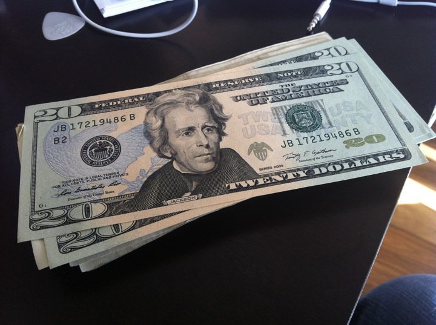

I’m really surprised I didn’t read more about this today, but I imagine in the coming days more people will have something to say about it. [China and Russia announced today that they would only be trading in their respective local currencies for trade between their own countries](http://www.marketwatch.com/story/china-russia-to-drop-dollar-in-bilateral-trade-2010-11-23) and abandoning trade settlement with the US dollar.

This is big news.

Ever since the abandonment of the gold standard, all international trades have historically been settled using the US dollar. This coveted position is known as the US Dollar’s Reserve Currency status, and it effectively gives protections for the United States that other countries don’t have. For example, even though the United States has continuously debased its currency by printing money (expressed in terms of gold, the US dollar has lost about 98% of its value since the Federal Reserve came into existence), the US dollar is still in demand since it’s required by other countries to settle trade. As soon as other countries stop using the US dollar to settle their trades, the US dollar will start to collapse – no country will want to hold the dollar since it will continue to lose value rapidly. We know this because the US has, via QE1 and QE2, more than doubled the entire monetary supply, which will lead to huge amounts to inflation (it already has – food is up, oil is up, energy is up, commodities are up).

Both Russia and China are downplaying the significance of this event, but I can’t help but feel it’s a strategic move, at least for China, to eventually abandon the US dollar completely for trades with other countries. China has been encouraging its own citizens to start accumulating gold these last few years, and a collapse or further weakening of the US dollar will only push gold prices higher.

We’ll see what happens next, but I wouldn’t be surprised if more countries start settling trades in local currencies as well.