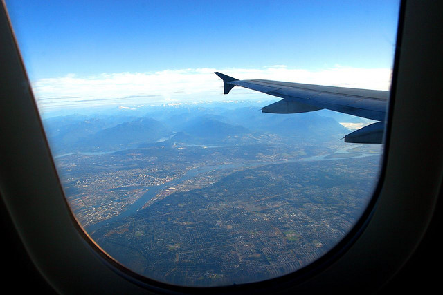

I’m only about a month away from leaving on my big adventure. First stop is obviously Buenos Aires, and then over to Ireland to drink one of these [bad boys](http://apeatling.wordpress.com/2010/11/19/litre-o-guinness/) with Andy.

After that, I really have no plans, other than to hit Serbia sometime around July. I also have some family that’s visiting China in August, so I may hit that as well.

So, if you were slowly making your way around the world, where would you go? What would you want to see?