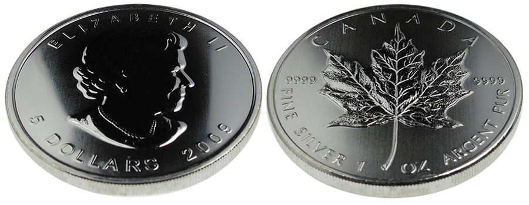

In times like this, I hate being right.

I met with a few financial people Friday afternoon at their offices in Abbotsford. As I was leaving, I casually asked everyone who worked there what they thought about the recent run of gold. Surprisingly (or not surprisingly, depending on how up to date you are with what’s going on), they didn’t seem to think it meant anything, and that the US economy was going to recover shortly. I then made a comment that I wouldn’t be surprised if the US did another round of Quantitative Easing (QE3 I dubbed it), but they simply laughed that comment off.

Not more than 48 hours after I was there, Ben Bernanke goes on 60 Minutes and says [that another round of quantitative easing is definitely possible](http://www.reuters.com/article/idUSTRE6B50D020101206). That guy seems to be determined to destroy the US dollar at all costs.

One of the side effects of Quantitative Easing is that it forces the value of the dollar down, essentially making exports cheaper (while at the same time eroding the savings of all of its citizens). While the prime goal of QE (at least from the Fed’s perspective) is to inject liquidity into the system, at its core it’s definitely a form of currency manipulation. Why that’s important is because the United States keeps whining about how China is manipulating the Yuan, but the United States is no better.

### Gold And Silver

Gold and silver have always been a hedge against currency manipulation. That’s why at various times in the history of the world the storage and ownership of gold has been made illegal by various corrupt governments (since it’s hard to manipulate a currency when people own a different form of it that can’t easily be devalued). As the US and other countries continue to debase their currencies by printing more money, the value of gold and silver (relative to these currencies) has been slowly creeping up over the last few years, with gold hitting a high of around $1,420 USD the other day, and silver (after Helicopter Ben Bernanke made his speech on TV), trading at a 30-year high of nearly $30 USD/oz.

I currently have around 20% of my retirement portfolio in precious metal stocks. Back in the day when I had a financial advisor (I don’t anymore) I asked them to add some to my portfolio, even though it wasn’t their recommendation at the time. While the rest of the items in my portfolio went up slightly, the precious metals were the real winners last year with gains of around 25%.

While precious metals have made big gains this last year, I think the best is yet to come based on what’s going on in the world. Ireland is in the process of receiving a big bailout, and rumour has it Spain isn’t that far behind. Prices in the US are going to be heading north over the next year, thanks to the massive expansion of the money supply by QE1 and QE2. If Bernanke does another round of QE, it’s only going to further erode the purchasing power of the US dollar, and cause more people to head towards the safety of precious metals.

In fact, since I was in Vancouver on the weekend and have always wanted to own some physical silver, I picked up some 99.99% silver coins (made by the Canadian Mint) from [J &amp; M Coin and Jewellery](http://bullioncoinsandbars.com/). Several of the investment grade coins they have on their website were already sold out by the time I got there, and many people were in the store purchasing 10oz bars of silver. My friend Duncan went to a bullion place out in Richmond around the same time, and not only were they completely sold out of silver coins, but Duncan purchased the last of the silver bars they had. So, not only are prices high, but precious metal stock is definitely low, at least in the Vancouver area.

### How High Can They Go?

Despite being at a high of roughly $1,420, gold still has quite a long way to go before it reaches its all-time high. In terms of inflation adjusted values, gold once hit approximately $5,000/oz. Given that I think we’re in the midst of a global debt crisis, hitting that previous high is definitely a possibility. At that price, it’s possible for silver to hit $100/oz or higher as well (which is nearly 3.5x the price where it’s currently at).

Whether or not we see those prices really depends on what happens next year with global currencies, particular the US dollar. But if Ben Bernanke’s hints are any indication, it’s likely we’ll see another round of Quanitative Easing next year sometime.