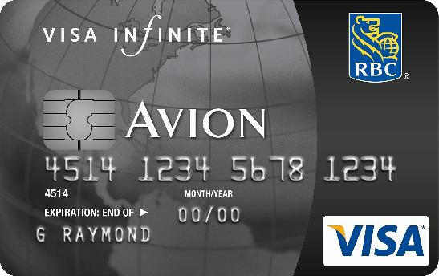

Random Visa Card

I received an automated call last week from TD Visa letting me know that my card had been deactivated due to fraud. Of course, there were no unauthorized transactions that I could tell on my VISA, nor has there been any previously when this has happened.

In the past few years, I’d say this has probably happened three of four times. Each time it does, I have to head down to the bank and pick up my new card about a week later. It’s nice that they are trying to reduce fraud, but not so nice that it causes an inconvenience, first because it takes my main VISA card out of commission, and second because I have to make time to go down to the bank and sort it out.

The thing is, I’ve never been able to have anyone tell me which particular transaction on my VISA card threw up the red flags. At this point I honestly don’t even really think it’s a real issue, just one that’s invented.

Now why would they do that? Simple.

During the activation process, the agent on the other end of the phone spends a few minutes trying to sell you insurance products meant to protect your balance in the event you are unable to pay them or work. If the cost of replacing a VISA card is less than the money they make on those insurance products, then it’s in VISA’s best financial interest to periodically replace cards and make their sales pitch. What bothers me the most is that the card I have is one of TD’s most privileged cards, and yet this card replacement routine seems to happen way more than it has on any other card I’ve owned.

If you’ve ever experienced one of these sales pitches, they are fairly laughable. The operator at the other end of the phone claims that the activation process will take a bit of time, but while waiting, “why don’t we discuss a few products that you are uniquely eligible for.” Given that I can send email around the planet in less than a second, I don’t buy into the assertion that activating a VISA takes more than a few seconds.

I have no proof that this is what they are doing for sure, but it seems more reasonable to me than shutting VISA cards down for unknown reasons. Several of my friends have reported similar experiences dealing with TD Visa as well, so I suspect something is going on.

Anything similar ever happen to you?