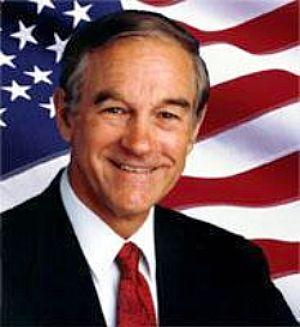

Ron Paul, one of the most vocal opponents of the monopoly the Federal reserve has in the United States, has just been [appointed to the head of the Federal Reserve oversight committee](http://www.politico.com/news/stories/1210/46198.html). He’s been denied the position twice before, most likely because he’s been itching to audit the Federal Reserve and finally make the Fed accountable.

Well, today Ron Paul finally got the job, which is a good thing as far as I’m concerned.

Ron’s been a long time advocate for abolishing the Federal Reserve completely (he wrote the popular book, “End The Fed”). The Federal Reserve has contributed to the US dollar losing approximately 97% of it’s purchasing power since it came into existence, so it’s no surprise that Ron Paul wants it to end.

I fully expect that Ron Paul will be pushing for a full audit of the Fed (he won the right for a partial audit this year, which revealed that the Fed had been lending large amounts of US money to foreign countries practically for free). Despite being responsible for the US monetary system for nearly 100 years, the Fed has never had a full audit, so nobody really knows how deep the rabbit hole goes.

In addition, Ron Paul believes Fort Knox, the storage facility for all of the United State’s gold reserves, should be audited as well, since nobody has accounted for the gold there since the 70s. Many people believe that a lot of it is gone, but until it’s audited, nobody knows for sure.