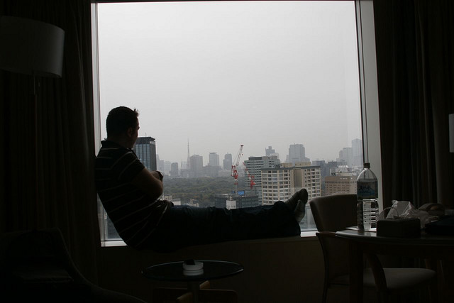

In less than three weeks, I’ll be hanging out in a nice Vancouver hotel, doing a last little bit of shopping before boarding a plane and heading to Argentina for three months (and after that, New York City and then Europe). While I’m definitely looking forward to a new adventure, I am not looking forward to the nearly 24 hours of traveling I have to do in order to get to Buenos Aires. But c’est la vie.

I keep getting asked a ton of questions, so I thought I’d answer a few of the most common ones here.

### What Made You Decide To Do This?

Since I work from home and coffee shops during the day, I’ve often told people that I have the ability to work anywhere in the world. After saying that though, most people then ask me why in the world I am working from coffee shops in Chilliwack when I could be anywhere in the world? It’s a good question, and one that started the wheels turning in my head.

Chilliwack has been great for me. In the two years I’ve been here, I’ve done a lot of soul searching and put a lot of things behind me that had been bothering me. In fact, some of my family commented that I seem like a new person these days, especially compared to the person I was while working 60 hour weeks in Vancouver. But truthfully, I’m feeling a bit bored and restless lately. It’s great being around my family, but there’s not really many social activities in this town, especially for single people.

With that in mind, when January of this year came around I started formulating a plan to leave. By the summer, I still hadn’t made any commitment to go, and wasn’t entirely sure it was going to happen. I had a few conversations with some family members at that point who convinced me that if I didn’t end up going, I would probably regret it for the rest of my life.

When Cortez reached the new world, he burned all his ships to keep everyone motivated. So, I decided the best way to make sure I actually went on this adventure was to set a few things in motion that I couldn’t easily undo – I gave notice on my apartment and secured a storage locker.

### Are You Getting Excited?

Truthfully, not really. I suspect, as others have pointed out, that it won’t be until I’m on the plane that I get excited. I have so much going on around here during the Christmas break that I don’t think I’ll really have much time to think about it until it’s nearly upon me. But, I sure hope I get excited soon!

### When Are You Coming Back?

I’m not sure! If I have my way, I probably won’t be back until next Christmas. But that depends on a lot of things not entirely in my control, so we’ll see. But given that I’ll literally be half way around the world in the summer, it seems silly to head home when I can simply keep going and eventually end up there on my own.

### Where Are You Going?

So far I’m definitely going to the following locations:

- Buenos Aires, Argentina
- Iguaza Falls, Brazil/Argentina
- Rio De Janeiro, Brazil
- Cuzco, Peru
- Maccu Picchu, Peru
- Montevideo, Uruguay
- New York City, USA
- Shannon, Ireland
- Dublin, Ireland
- London, England
- Novi Sad, Serbia

I don’t have a plan for Europe yet, but I still have three months to formulate one. 50% of me (the younger, more adventurous me) wants to simply backpack around and stay at hostels for a few months while working from coffee shops. The other 50% of me (the “get off my lawn” part of me) is thinking it may be better to rent a short term apartment somewhere and simply do occasional trips from there. So we’ll see.

### How Much Did You Save For Your Trip?

I saved $10,000 roughly for the trip, but as I’m doing occasional client work as I go, am hoping that I don’t dip into that too much. I know one person who traveled for a year who needed around $70,000 for the trip, but they weren’t working while they traveled. So, I think what I have should be enough to keep me going for six months at least, and most likely a full year.

### How Much Do You Think You’ll Spend?

I’m not entirely sure to be honest. I’m actually fully expecting to *save* money by moving to Argentina, since the cost of living is far lower than North America. In addition, taking my car off the road and cancelling my tenant insurance will save me around $350/month. That’s offset slightly by having all my stuff in storage (around $90 a month), but I’m still ahead by a few hundred a month. Once I get to Europe I imagine accommodation will go up drastically, but I should have enough saved to offset that a bit.

I’ve already pre-paid for all my flights up until Europe, after which I’ll have to buy some more. I’m guessing I’ll probably spend around $5,000 on flights and transportation by the time I’m done, possibly a bit more depending on how adventurous I get.

### Is It Hard To Leave?

Not really. The thing is, I’ve moved away from Vancouver before. Back when I was 23 I moved to Ottawa and spent two years living out there, only coming back once or twice a year. So, in a lot of ways, it’s not different than that.

And in fact, if anything it’s going to be a lot easier this time. Back when I moved, email was still something you only checked a few times a day, and very few people had cell phones. Now, email is ubiquitous with my daily life, as is having access to cheap data or WiFi. Also, because a lot of my day to day working routine is spent on Skype and iChat, most people probably won’t even know that I’m gone.

### Full Steam Ahead

So, there probably won’t be too many updates on here up over the Christmas break, but I’ll pick things up again as I get close to leaving. I’d really like to document the whole experience with how I’m feeling, especially when I finally leave Chilliwack and head to Vancouver. If anyone has any other questions about my trip, feel free to drop a comment.