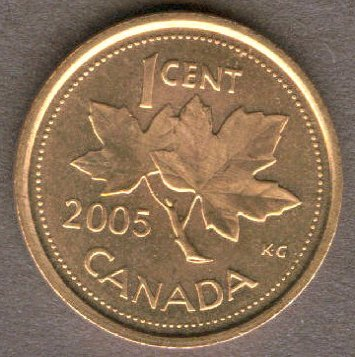

Yesterday the Canadian government alluded to a plan to completely remove the penny from circulation in the next 12 months. Their main motivation for this change is cost – the currently cost of a penny is around 1.5 cents, but the value of the coin is only 1.0 cent. So, the government would like to get rid of the penny.

Now what does that mean for the average person? To be honest, not a whole lot in my opinion.

First, retailers are supposed to round the final values to the nearest 5 cent value. If the item is less than 2.5 cents away from a lower price, retailers are supposed to round down. If it’s less than 2.5 cents to a higher value, retailers are allowed to round up. In theory this sum of all this rounding errors should equal zero, which means no net price change.

Second, it only affects cash based transactions, so anything digital (like interact or VISA) can still allow payments of pennies and fractional values.

Third, the rounding is only supposed to occur post-tax, so I can’t see retailers changing their prices (since ultimately once tax is applied again, they’ll probably get fractional values that need rounding). In addition, the cost of changing prices for most conventional businesses is non-zero (menus need reprinting, labels have to be redone), so I can’t see many businesses going out of their way to change public prices just to compensate for a few pennies.

### Will It Lead To Additional Price Inflation?

I personally don’t think it will make any difference. The reason why a penny now costs 1.5 cents is due to inflationary fiscal policies that have eroded the value of the dollar in general. This isn’t isolated to the penny – all Canadian currency is worth substantially less than it was a decade ago. The penny is just the first casualty since it’s worth the least. In ten years it’s likely the nickel will be next on the chopping block.

Unless retailers purposefully raise prices (and I don’t think they will), I think there will be little impact by removing the penny.

What do you think about the removal of the penny? Happy to see it go, or will you miss it?