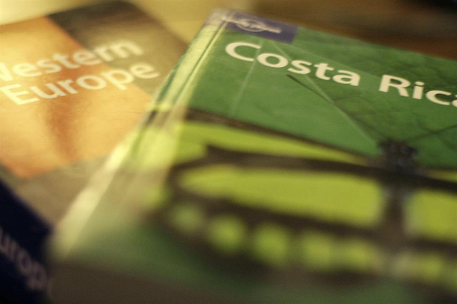

I’m one of those people that always [purchases travel health insurance](/tips/travel/buy-travel-health-insurance/) whenever I go out of country. Normally you just go down to the insurance broker, fill out a bit of paperwork, and leave with an insurance policy that will cover you in the event of any emergency.

I figured (incorrectly) that it would be just as easy to obtain insurance for my upcoming trip, which is why I left it until the last minute. I’ve slowly been chipping away at the problem for the last month or so, and finally managed to acquire some insurance.

### British Columbia’s MSP

Most of the problem with extended travel insurance is due to British Columbia’s medical services plan (MSP). Most BC residents pay into this system, either personally or through their employers. The MSP plan covers basic medical in the province, and allows everyone to obtain surgery (at no additional cost) or visit a doctor.

Unfortunately, there’s a clause in the MSP that says that each person much be physically located in BC for at least six month’s out of the year to be eligible for medical. That’s why most travel insurance plans only offer trip durations of six month’s – they are supplemental insurance meant to be used in conjunction with MSP.

### Long Duration Travel Insurance

It wasn’t until I started looking at insurance options that I realized that most travel insurance plans only cover a single trip, often no longer than 30 days or so. Obviously that’s not useful for a year-long travel adventure.

I looked online, and a few places recommended [World Nomads](http://www.worldnomads.com/af.aspx?affiliate=mignerd&subid=insure4year&path=http://www.worldnomads.com/insurance.aspx&utm_source=mignerd&utm_medium=textlink&utm_campaign=easy_url_generic) for travel insurance. If you like booking online, then definitely check out that option.

### BCAA Insurance

Thanks to my dad and step-mom, I’ve been a BCAA member for about ten years now. BCAA is where I normally get my auto and travel insurance, so I went down and talked to them. Sure enough, they had a six month plan as well, with an option to extend it longer. The only trick to extending it longer is that *you must* inform MSP that you will be out of province for more than six months. Each resident of BC is allowed one trip of up to two year’s duration every five years, as long as MSP is notified ahead of time. So today I made the call to MSP and let them know, which means I’m technically covered for up to January of 2013 (as long as I continue to pay my premiums)

So, I walked away from BCAA today with a full year’s worth of emergency medical insurance. While some of the online quotes I had were around $700 for the year, my final bill from BCAA was $490, and it includes up to $5,000,000 worth of medical services should the need arise.

If you do the math, that works out to around $1.50 a day, which is a small price to pay to know that you’ll be covered should an emergency come up.