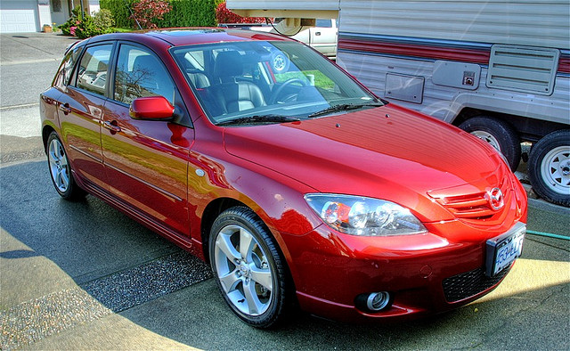

For some reason, I initially thought I could simply turn my car off prior to leaving for my year long adventure and it would be completely fine when I returned. After talking to a few people though, it turns out that you really do need to take special precautions to make sure your car will actually be functioning if you leave it for any extended period of time.

So if you’re looking to leave for more than a month or so, you should make sure you take the following precautions with your vehicle.

### What To Do Prior To Leaving

- Over-inflate your tires by approximately 5 PSI. This will help prevent the tires from flattening while you are away, which sometimes results in permanent deformation of the rubber.
- Do a complete oil change right before you leave.
- Fuel breaks down after about a month or so. If you leave the car for more than a few months, you may find that the gas has turned into turpentine while you were gone. To get around this, you need to add fuel stabilizer. Drain your gas tank to about the 1/8th level. At that point, put in some fuel stabilizer and run the car for a few minutes.
- Disconnect the battery, and put it on a trickle charger if one is available
- Put a rag in the tailpipe to discourage critters for making a home inside your car

If your car is going to be outside the whole time, it’s also a good idea to purchase a car cover and put it over top, that way you’ll minimize the damage to the paint from UV and weather.

### What To Do When You Return

If you don’t happen to have a trickle charger, there may be a good chance your battery is dead when you return. Either get someone to charge it for you, or possibly buy a new battery.

After reconnecting the battery, pull the rag out of the tailpipe and turn the engine over a few times – hopefully you’re car will fire back to life. The first thing you should probably do is make your way to a gas station and fill up the tank with some fresh can (which in the process will dilute the remaining fuel stabilizer).