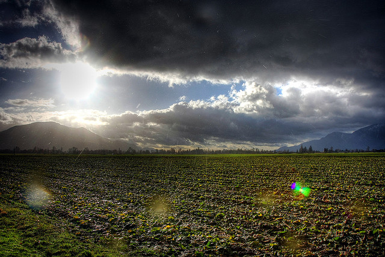

Tonight is my last night in Chilliwack.

It’s been nearly two full years since I packed up my apartment in Vancouver and moved my entire life back to the small town I grew up. At the time, I was in desperate need of a break from city life, and welcomed the thought of having some family around as well as a slower pace of life. Since then I’ve spent the last two years working from my apartment here in Chilliwack, visiting old friends, having dinner with family, and doing a little bit of soul searching.

Not long after I arrived back in Chilliwack my family started commenting to me about how much happier I seemed to be. Truthfully, the last few years that I lived in Vancouver were rather hard on me. I had multiple rounds of surgery, a pretty severe bacterial infection, and more than my share of 60 hour weeks that ultimately left me exhausted and stressed out. Shortly after I had my second round of surgery on my eye socket I remember lying in bed, high from all the drugs I was on, being thankful that I had surgery since it gave me a break from work and a chance to finally have a restful sleep. When you welcome surgery in your life as a means to escape it, something is obviously amiss.

Without a doubt, I laugh more now. I spend more time doing the things I enjoy in life, and less on the things I don’t. I no longer sweat the things I used to, nor do I spend time complaining about things that are generally outside of my control. In short, I’m a happier person than I was two years ago.

In just a few hours, I’ll finish packing my suitcase, and say my goodbyes to my family here in Chilliwack. First will be my dad and step-mom, where I’ve been staying for the past five weeks. As someone who has spent the last two years working from home and, for the most part, being alone at home, it’s been a welcome change having people around to chat with in the evenings. Shortly afterwards I’ll head to my mom’s house to give my mom and my grandma a hug, and then off to my sister’s house to say goodbye to them. My car is staying with my sister for the next year, so I’ll finish prepping it and hand the keys over.

After that, my friend Tony is picking me up and we’re heading to Vancouver. I’ll be staying at a hotel for a few days, partially to get a few good nights of sleep before I leave, and also to spend a few hours walking around the city, taking a few mental snapshots of the North Shore mountains and some of the city before I leave.

While I love Chilliwack and have treasured the time I’ve spent here over the last few years, I doubt I’ll be back living here in the near future. The truth is that I’ve found myself again, and it’s time to move on with life and continue seeing where the road leads me. Maybe I’ll make a few new friends along the way, maybe I’ll find a city to live for a period of time, or maybe I’ll even fall in love. Whatever will happen, it’s bound to be an adventure, and it’s nice to have something to look forward to again.

Saying goodbye to family is never easy, but I’m excited to begin the journey and to see some of the world. I’m fortunate that I can do my job from anywhere in the world, so I owe it to myself and to some of my friends and family (who may never get the chance) to take advantage of the opportunity and see it through.

Tomorrow I say goodbye to my two years in Chilliwack, and take the first few steps of a journey that will undoubtedly take my to new places, to new experiences and to new friendships. After months of preparation, it’s nice to finally be starting the journey, and I’m excited to depart on Tuesday for my first destination: Buenos Aires, Argentina.

To follow along with the adventure (I won’t be posting much about my trip on this site), make sure to check out [The Migratory Nerd](http://themigratorynerd.com) or follow along with [@migratorynerd](http://twitter.com/migratorynerd) on Twitter.