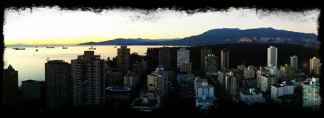

I posted a blog entry on my [personal site](http://www.migratorynerd.com/2011/farewells/) detailing how I was feeling last night. Since that time I’ve migrated to Vancouver and have checked into a nice suite at the [Coast Plaza and Suite Hotels](http://www.coasthotels.com/hotels/canada/bc/vancouver/coast_plaza/overview) in Vancouver.

Coast Hotels has supported various trips I’ve made over the years, and I’m definitely thankful to them for helping put me up from time to time. I’m actually in a suite on their top floor right now, with an absolutely amazing view of the Pacific Ocean from my window. If you’re looking for a great Vancouver hotel, then make sure you check out the Coast Hotels in Vancouver.

I’m about 36 hours away from starting the adventure, and I’m definitely getting excited now. I just ordered a six pack of beer via room service, and will spend the remainder of the night doing a bit of research and thinking about the adventure ahead of me.

It was obviously hard saying goodbye to my family earlier, but I know from experience that I’ll be back home before we all know it. It’s nice to finally begin the adventure after more than four months of preparation and expenses related to it.

Tomorrow I’ll be getting a haircut to help tame the afro I got going on, and then meet up with a few friends for dinner. After that, I’ll be Buenos Aires bound!