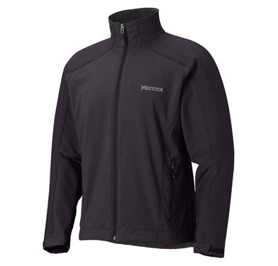
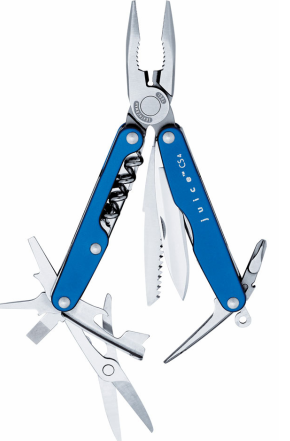
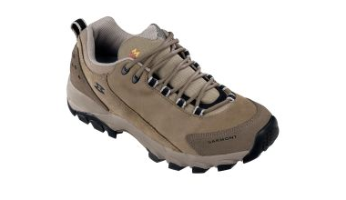

I’m down to the 15 hour mark right now, and am just enjoying a beer in my Vancouver hotel room prior to heading out and meeting up with a few friends for dinner.

I went out yesterday and bought a few more things to take along on the trip, so I wanted to highlight those here.

### Marmot Jacket

I originally went to MEC in Vancouver to buy a nice jacket for my trip. I was looking for something really light that I could possibly wear in the evenings, and also something to add a bit of warmth if I’m in Europe later next year. I found the perfect jacket at MEC, but they unfortunately didn’t have the right size for me. So, I was forced to leave empty handed.

I walked across the street to Europe Bound, and found a fairly similar [Marmot Sharp Point Softshell Jacket](http://www.amazon.com/gp/product/B002LKG5E2?ie=UTF8&tag=duanstor-20&linkCode=as2&camp=1789&creative=9325&creativeASIN=B002LKG5E2). The one at MEC was actually grey, which I thought was a good colour to travel with, but unfortunately the Marmot one was black. On the plus side though, the jacket was marked down 50%, and only cost $100. Given that I was in a bit of time crunch and it was on sale, I decided to get it, since it was fairly close to what I was looking for.

I’m pretty happy with the purchase, and it’s definitely a better quality than the little fleece jacket I came to Vancouver with. So I passed on my other jacket to my friend to take back to Chilliwack for me, and will be taking the Marmot jacket with me on the trip.

### Leatherman Juice CS4

I’ve never been a big fan of Swiss army knives or Leathermans, mainly because I never seem to find a use for them. But, given that I don’t have any tools with me in any of my bags, a friend suggested that a multipurpose tool might be a good item to bring along on a travel adventure. Since I was in the mood to spend some money, he didn’t have to twist my arm very far to get me to buy one.

The one I ended up settling on was the [Leatherman Juice CS4 Pocket Multi-Tool](http://www.amazon.com/gp/product/B0007UQ188?ie=UTF8&tag=duanstor-20&linkCode=as2&camp=1789&creative=9325&creativeASIN=B0007UQ188) in a Glacier Blue colour.

From the Leatherman website:

> The Leatherman Juice Cs4 is our second largest Juice model, and just like its bigger brother, it’s the perfect size for a purse, pocket, glove- or tackle-box. Smaller hands will appreciate all the same power and features as our full-size model, with handles sculpted just for them. The colorful Juice Cs4 might just make the “junk” drawer into the “I-don’t-need-anything-but-my-Leatherman-in-here” drawer.

It’s smaller than the typical multipurpose tool, which I quite like since it will fit into my pocket easily. Also, it has a corkscrew, which many of the other tools didn’t have. Since I’m heading into the heart of wine country, I thought that would be a good tool to have. It also came in a really cool blue anodized aluminum colour.

### Garmont Montello II Light Trail Shoes

Shoes are always a pain to take with you when you travel. Not only do they take up a ton of room in a suitcase or bag, but many shoes simply don’t look good with shorts (or for the women, dresses or skirts). I came to Vancouver with a pair of leather Clarks (which look great with jeans, but would make me look like some beer drinking lumberjack if I were to attempt to wear them with shorts), a pair of running shoes (I’d rather not have these, but running in sandals or hiking shoes is just asking for a really bad injury), and a pair of sandals. While I love the Clarks for when I’m in jeans, they really aren’t a very versatile shoe, especially in a warm destination.

A few months ago I was down at MEC and noticed that they had some hiking/trail shoes that looked a lot like a casual shoe. They were a bit pricey, but they seemed like the perfect solution to my little dilemma.

So yesterday I walked into MEC, and eventually settled on the [Garmont Montello II Light Trail Shoes](http://www.mec.ca/Products/product_detail.jsp?PRODUCT%3C%3Eprd_id=845524442625348&FOLDER%3C%3Efolder_id=2534374302759879), which not only have a great hiking/trail sole, but look like a typical pair of casual shoes. I didn’t have a pair of shorts on me at the time, but the colour and the style I think will work well with a pair of shorts in a pinch, and also look pretty stylish with jeans as well.

I sent the Clarks home with my friend yesterday, and am traveling with the Garmon shoes, a pair of sandals, and a pair of running shoes as well (for whatever athletic things I get myself into).