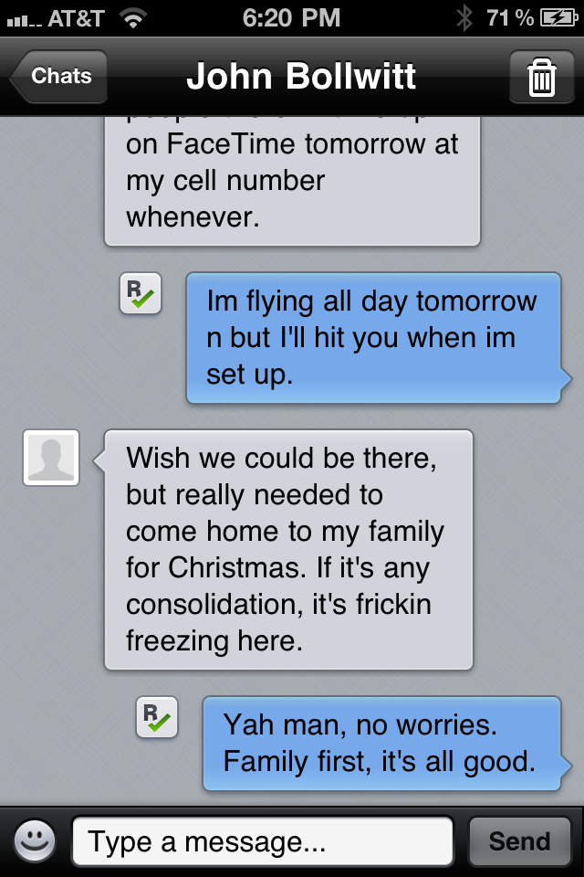
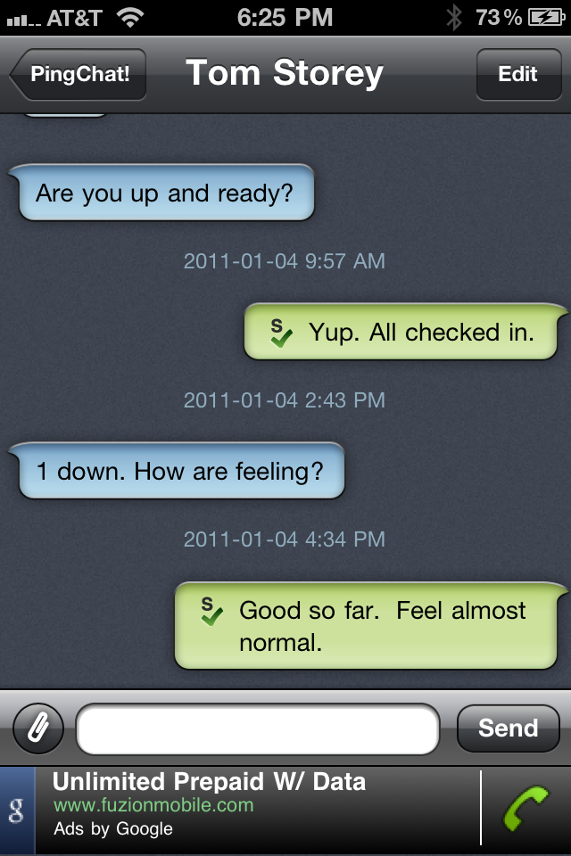

While SMS is great when you have a package that includes unlimited SMS messages, it can be extremely expensive to either send or receive international SMS messages, often to the tune of $2/message. Here are a few alternatives that are available for the iPhone to help reduce costs.

### Kik Messenger

A few days ago, my friend John recommended that I grab a copy of the [Kik Messenger](http://itunes.apple.com/us/app/kik-messenger/id357218860?mt=8) application on the iPhone. Kik is an SMS-like application that allows you to have real time text chats with your friends over data or WiFi.

Because it supports push notifications, it’s as real-time as SMS is, which makes it useful for communicating with friends and family back home. And because it uses the data network instead of SMS, you don’t have to pay SMS fees for each message, which can save you a bundle of money when you’re traveling abroad.

Unfortunately at this point in time, Kik doesn’t really support sending any type of media other than text. But it’s still a great little tool that can be used to keep in touch with friends and family back home without racking up huge SMS fees.

### PingChat

Another great alternative to Kik is called [PingChat](http://itunes.apple.com/us/app/pingchat-the-ultimate-cross/id371769677?mt=8). PingChat is very similar to Kik, but it also has the ability to send media (such as photos), which is a nice advantage.

One downside (at least on the version I’m using) is that it has advertising showing in the chat window. I would normally buy the pro version that didn’t have the advertising, but unfortunately they don’t seem to have a pro version. So, you’ll probably have to settle for the advertising if you are using PingChat.

Both of these tools are simple to use and can drastically help lower cell phone bills while traveling. If you’re anything like me, I rely quite a bit on SMS during the day, and these tools will undoubtedly save me a lot of money over the next year.

### iMessage

Apple announced iMessage over a year ago, and it’s a direct competitor to both Kik and Pingchat. While iMessage works well, the downside is that it can only be used to send SMS-less messages from an iOS device to another iOS device. So even if you have an iPhone that supports iMessage, you’ll likely want to use one of these other ones as well to talk to non iOS owners.

### WhatsApp

WhatsApp has become my favourite SMS alternative for the iPhone, mainly because almost every traveler I have met in the last few years not only has it installed, but uses it routinely. I’ve been using WhatsApp to keep in touch with many people I have met during my travels, and it works as advertised. You can get it for iPhone, Android and I believe Blackberry devices.