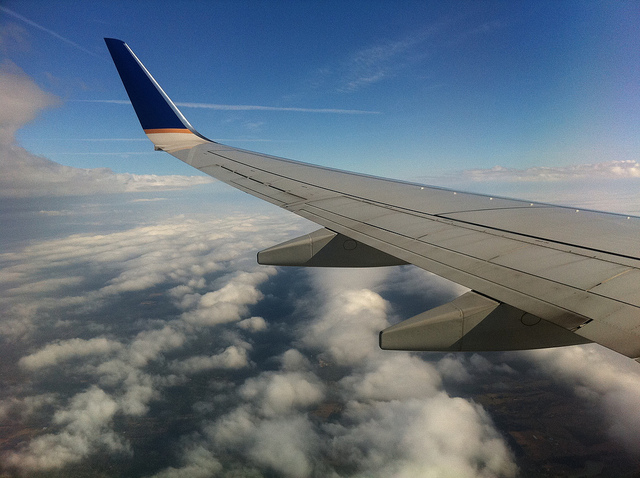
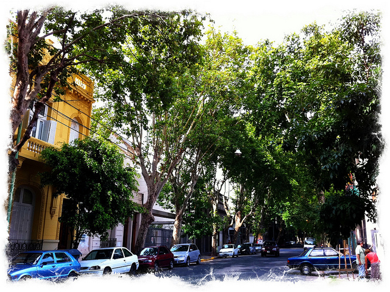

I landed in Buenos Aires yesterday (it seems like a lot longer based on how much I’ve done since then), but so far it is shaping up to be an amazing experience.

The flight from Houston was fairly uneventful. I popped a few anti-anxiety pills and then did my best to sleep for as much of the flight as I could. We hit a fairly long bit of turbulence right as we were passing the equator (not sure if that’s the reason), so that kept me from sleeping for a while. But after that was done, the rest of the flight was fairly smooth.

Once we were on the ground, I slowly made my way to the customs area. The first area you encounter is the reciprocity area where Canadians, Europeans and Americans have to pay an extra fee to visit Argentina. The line was about 15 minutes long, after which point I paid the $75 USD fee and proceeded to immigration. Nobody really asked me any questions about my visit, but simply took my completed immigration form and stamped a 90 day visa into my passport.

After customs you go to the baggage claim area and pick up your luggage. My suitcase was basically waiting for me when I arrived, so I grabbed it and went to the final security checkpoint (where they x-ray your bags again).

### Exchanging Money

I read online somewhere not to use the first currency exchange in the airport due to the poor rates they offered. When I walked by they were offering 3.4 pesos roughly for every USD, which is quite a bit less than the 4 peso per USD that the currency actually trades at. Needless to say I kept on walking.

Immediately after leaving the customs area is a Bank De Nacional on the far right. The line was about 15 people deep, but they were offering pesos at 3.97 per USD, which was quite a savings on the other currency exchange. It took me about 20 minutes to make it through the line, and I walked away with about 1200 pesos (roughly $300 USD).

### Taxi To Palermo

I prebooked a taxi from Canada with [Taxi Ezeiza](http://www.taxiezeiza.com.ar/en/tarifas.html). I’m sure I could have found a cheaper rate, but I was more concerned with not having any hassles getting downtown. They have a flat fee of 150 pesos from the airport to downtown, and it’s all pre-arranged with your arrival time.

The taxi ride to Palermo took me about 30 minutes, and I got to check out some of the sights as we drove.

### Arrival at my Apartment

I arrived at the furnished apartment I’m renting sometime around 12:30pm, and thankfully the landlord and the booking agent were both waiting for me. They gave me a quick tour of the apartment and we went over a few details, then I signed the rental agreement and handed over the nearly $2000 USD I had been carrying on the plane with me.

I’ve actually been pleasantly surprised with the apartment. The kitchen is fairly nicely stocked up, and even includes a bit of dish soap and enough towels to do the dishes and what-not. There are even a few power adapters in the drawers and a pile of literature on the city to study up on and to help explore. So they’ve really done a good job of making the apartment comfortable for foreigners (there names of all the contact people are nicely located right beside the phone in case I ever need to call anyone).

### Palermo

I went exploring as soon as I unpacked and snapped a few photos of the Palermo area. For the most part it is fairly clean and most of the streets have really nice trees all along them. I saw lots of people walking around with children, and a few people carrying nice SLR cameras, so I don’t think there’s anything to worry about in this area.

I haven’t sorted out my cell phone yet, but will most likely do that tomorrow afternoon sometime. Then, it’s just a matter of getting some groceries and then I can start exploring the city a bit more. I’d like to maybe go visit the zoo or the Recoleta cemetery this weekend.