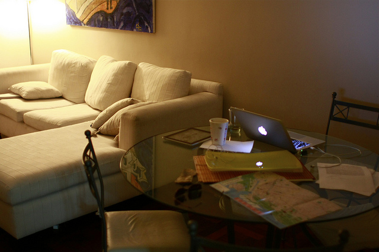
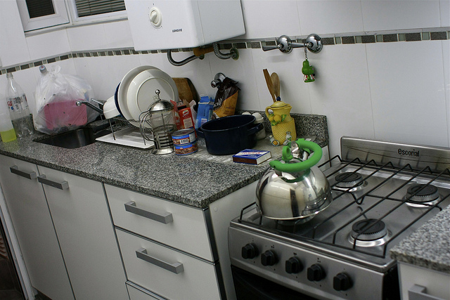
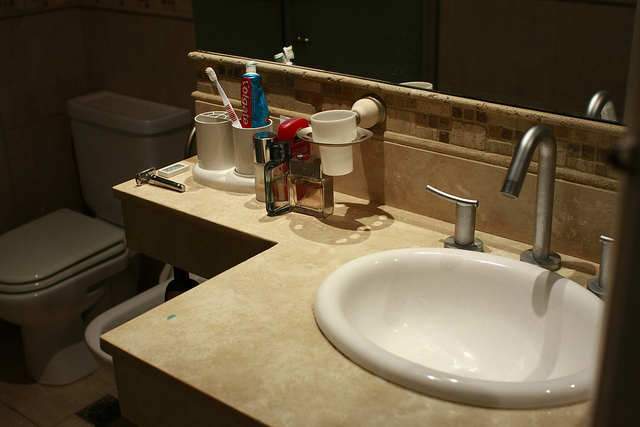

Here are a few photos from the little apartment I’m renting in Palermo Soho. It’s located near the corners of Paraguay and Gurruchaga if anyone is interested.

Where I Work

Kitchen

Bathroom

There are a [few more on Flickr](http://flickr.com/photos/migratorynerd).

In terms of location, the apartment is about a 5 block walk to the area of Palermo Soho with all the fancier restaurants and pubs (although, there are lots of little ones all over the place). About three or four blocks north of here is one of the main subway lines in the city, which will be nice (as soon as I start to use it). The only real downside is they are doing renovations on the apartment downstairs, and there’s a bit of noise during the day. But, nothing I can’t put up with.