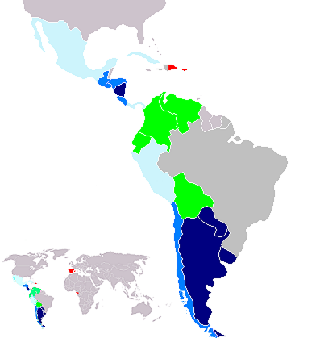

Had you asked me a few months ago about what language they speak in Argentina, I probably would have just said Spanish, assuming (erroneously of course) that all spanish speaking countries all speak the same form.

Now that I’m here, I know what a lot of people in North American probably don’t – in Argentina they speak a fairly different form of spanish based on [Voseo](http://en.wikipedia.org/wiki/Voseo), and also have some very unique pronunciations.

Locations Where Voseo Is Spoken

The main change in voseo that the second person singular (equivalent to *you* in english, i.e. *you are*) is changed from *tu* to *vos*. Unfortunately very few books even make mention of this change, and it’s only something you’ll be exposed to in voseo speaking countries. The problem is that very few books talk about it, so none of the conjugation tables show you how to properly conjugate verbs for that form.

Pronunciation is quite a bit different down here as well. The first-person singular in spanish is *Yo* – it’s the english equivalent of *I*, for example *I have*, and it’s pronounced as it looks. In Buenos Aires, Y and the Spanish LL (for example, *pollo*, the spanish word for chicken) are pronounced more like an english *sh* sound instead of a *y* sound. So in Spain you would pronounce *pollo* like *po-yo*, but here in Buenos Aires it’s pronounced *po-sho*.

I’m making progress on learning, but the going is still slow. I’m just finalizing a spanish teacher to hopefully start next week, and I’m hoping the pace at which I learn picks up.