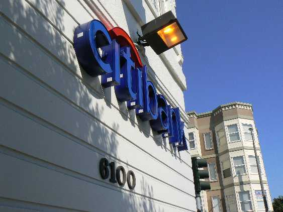

Photo By kiwanja on Flickr

Obtaining money has little idiosyncrasies in every part of the world. In the Caribbean for example, it’s easy to obtain money in US dollars, but hard to get anyone to break any of the bills the ATM machines give out. When I was in Costa Rica, we had issues because many bank machines only allowed 4-digit pins, while some banks in Canada (notably Royal Bank at the time), used five digit pins. So we had to drive nearly 60 minutes out of town to find a bank machine that would take five digits.

Buenos Aires is no different, although the situation is slightly better. I commented on another post how it’s hard to break a 100 peso bill here (not impossible, but difficult unless you’re spending 60 pesos or so). That’s the equivalent of around $25 in Canada. Imagine going to 7-11 back home, handing over a $20 bill to pay for something, and being told it’s too large.

### Bank Limits

Many of the smaller banks here have limits of around 300 pesos a transaction. That’s actually a fairly decent amount of money here (a really nice two-person dinner would run you around 100 pesos or so), but it’s prohibitive for most foreigners due to:

- The foreign transaction costs here are typically around $4 USD per transaction. So, that’s almost a 5% fee on 300 pesos
- Most foreigners pay rent in US dollars, and 300 pesos is only around $75 USD. That means it would take you almost 15 days of ATM usage to get enough money for rent

### Lack Of Small Bills

Most bank machines I’ve gone to only give out 100 peso bills. They’re difficult to cash unless you buy over 60 pesos worth of goods or services, which isn’t as easy as you would think around here. Most smaller mom-and-pop shops don’t even accept 50 peso or 100 peso bills, so you really need to think out where to cash them and obtain change.

### The Solution

I’ve tried several banks now, and I’ve found two that work quite well. The first is HSBC, which has branches all over the world. The branch I’ve been using is right neat the Alto Palermo shopping centre, and the bank machines even have english options. The limit appears to be 1000 pesos at a time, which is about $250 USD (but much better than the 300 peso machines). Unfortunately the machines at HSBC only give out 100 peso bills, so you can’t get change there.

The best option I’ve found is Citibank, which is basically right across from the Alto Palermo shopping mall entrance on Sante Fe avenue. The limit there is 1000 pesos as well, but you can get the machines to give you some change by asking for 990 pesos instead (which will give you nine 100 peso bills, one 50 peso bill, and four 10 peso bills). I haven’t tried it yet, but rumour on the street is that you can hit an ATM machine several times a day, as long as you’re under your daily withdrawal limit back home. The downside of course is that you’re paying 16 pesos ($4 USD) every time you take money out, but c’est la vie.

In terms of banking fees, a lot of people get into an uproar paying $4 in fees. I have an account with TD back home that doesn’t charge me any local fees back home (many people get charged there as well), so I don’t look at the $4 as anything too offensive. Years ago people used to only be able to use Traveler’s Cheques, and those were not only time consuming but expensive as well. So being charged $4 to be able to walk into an ATM that’s over 8,000 kilometres away from my bank in Canada and take out foreign money with a few clicks doesn’t seem like such a bad deal to me.