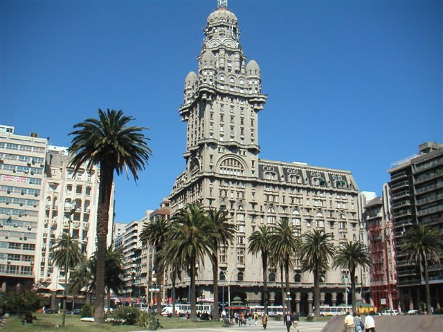

Photo From teacherslatinamerica.blogspot.com

The country of [Uruguay](http://en.wikipedia.org/wiki/Uruguay) is just a short ferry ride away from Buenos Aires. It’s always been on my list of things to see while I’m down in Argentina, but I didn’t have any definite plans in my mind for when I would go over.

Usually people go over to Colonia del Sacramento in Uruguay, since it’s just a short ferry ride away. However, an even greater adventure is the city of Montevideo, which is at least a 2.5 hour ferry ride away from Buenos Aires (if you take the fast ferry, longer if you take the slow ferry).

So this weekend I’ve decided to head over to Montevideo with [Gus](http://gusfosarolli.com/2011/01/buenos-aires-2011-day-5-8/) and Russ. We’ve paid for a full tour, which includes both ferry rides, a lunch, and a full day of walking. Here’s a rough itinerary.

- 5:45am – wake up!
- 6:15am – head to the ferry port
- 6:30am – check in at the ferry
- 8:00am – ferry ride to Montevideo
- 10:30am – arrive in Montevideo
- 10:30am – 1:00pm – touring!
- 1:00pm – lunch in Montevideo
- 2:30pm – 8:00pm – touring!
- 8:30pm – 11:00pm – ferry ride back to Buenos Aires

The total cost for the trip is around 650 pesos ($161), and I’ll probably tack on a glass or two of wine during lunch in Montevideo. Montevideo is supposed to be a really pretty city, so I’m definitely looking forward to spending Saturday there. I’m also looking forward to getting another stamp or two in my passport!

Both Gus and I will be bringing along our SLRs, so there should be a ton of photos to show off on Sunday.