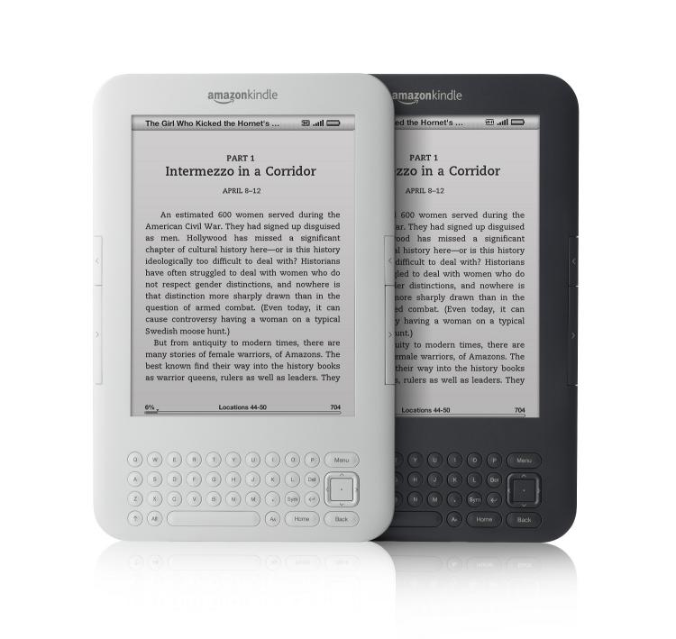

I came to Buenos Aires with an iPad, a Macbook Pro, a Canon DLSR, a 28mm lens, a Kodak Playsport HD camera, and a Canon something or other point and shoot camera – quite the load. Here’s a little update on how it’s going.

### The Good

The iPad is great for reading at home, but it’s not so good for reading out in public in a city with a lot of petty crime. In fact, I don’t think I’ve seen a single iPad down here since I’ve arrived. As a result, I’m thankful I brought my Kindle with me, since it blends into a coffee shop scene far easier. Right before I left Canada I purchased (or rather, my dad purchased for me), a little blue Kindle cover, so my Kindle looks a lot like a normal book or maybe even a daytimer if you didn’t know what it was explicitly. That’s great, because I doubt anyone is going to ever look at it likes it’s something to take.

I prefer the iPad over the Kindle for reading mostly (especially for the Spanish books I’m reading, since a lot of it is rasterized, and they don’t scale properly on the Kindle), but the Kindle is much safer to take out in public, and a bit lighter to carry around.

The iPhone 4 has actually been a pretty trusty travel companion out here. I managed to get a local SIM in Argentina (thanks to my factory unlocked phone) and can make local calls from my phone. Rates are pretty high, so I haven’t really used it. But it’s nice to at least have in case I want to flip on Pay As You Go data, or plan something with someone local. Also, the camera on the iPhone 4 has worked really well for impromptu photo opportunities.

The Kodak Playsport has been fun, but it’s a bit under-utilized now. Truthfully, I keep it in the safe at my place here and have continually forgotten to take it out. I’d like to take a lot more video, and so far like the Kodak Playsport, but the jury is still out.

### The Bad

It’s great having my Macbook Pro with me, and I’m sure when I get to Europe I’ll be thankful for it. But out here, I’m fairly hesitant to take it out in public. I was talking to Dale today and suggesting I may pick up a cheap Netbook in New York to take along with me as well. That way I can leave the Macbook Pro safe in the room and yet still take advantage of coffee shops periodically to do routine coding or keep up with the internet world. I’ll toss that idea around in my head a bit more.

Also, I’m finding the 28mm lens a bit limiting. Really, there’s no perfect one lens camera solution, so I’m sure I’d be finding faults with any other setup. But now that I’m out taking photos again (my SLR sat collecting dust nearly the entire time I was out in Chilliwack), I’m starting to miss some of the fancy gear I sold, partially to pay for this trip. I have a very specific goal with where I want my finances to be while traveling, so I can’t really swing any new camera gear right now. But there’s a small chance I may pick up a Canon 5d Mark II in New York while I’m there, which would make the 28mm lens more usable for scenery. Then I can simply augment it with an 85mm prime lens for portraits.

### The Ugly

Truthfully, I haven’t really used my Canon point and shoot all that much. I’ve taken it out twice now I think, and both times I brought it back unused. Maybe at some point during my trip I’ll make better use of it, but for now it’s just taking up room in my bag. So, if I don’t end up using it over the next two months, I may simply try to ditch it on Craigslist in New York when I get there in March.