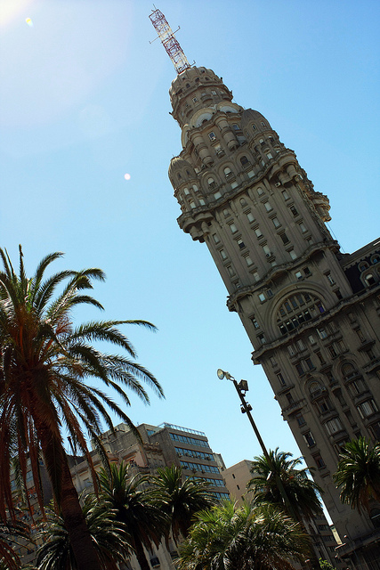
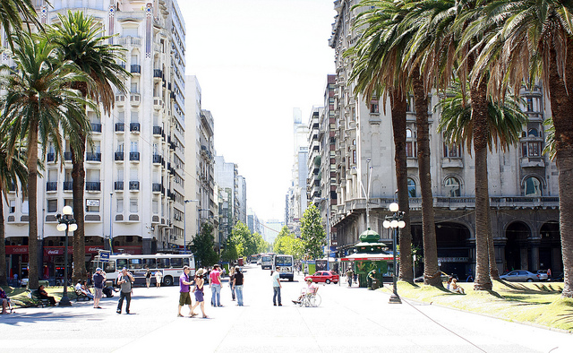
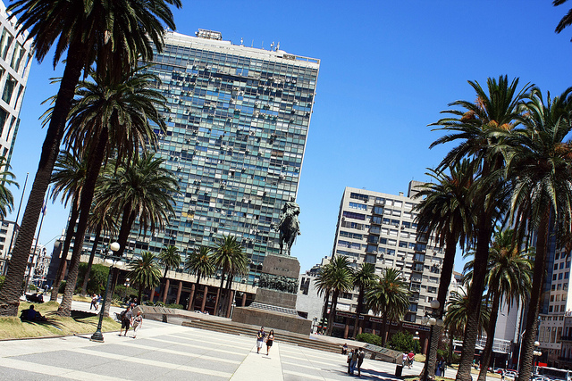

About a week ago, Gus, Russ and I were talking about how we would all like to visit Uruguay at some point on our adventure. There are two options that most people consider: a trip to Colonia, or a trip to Montevideo.

Due to time constraints, most people end up taking the trip to Colonia, since it’s not very far from Buenos Aires. Getting to Montevideo takes more time, and is generally more expensive, so most people choose not to do it. Since it is the capital of Uruguay, we decided that it was the place that we wanted to visit the most.

The ferry company that handles transportation from Buenos Aires to Montevideo is called [Buquebus](http://www.buquebus.com/cache/HomeARG.html) (pronounced “Bu-kay-bus”). It turns out that they were offering a [Day Tour](http://www.buquebus.com/BQBWeb/CompraDayTour?parPromo=PROM7&parPaquete=MPROBQ_2&parCiudadOrigen=BUE&parCiudadDestino=MVD) of Montevideo for only 640 pesos (around $160 CAD), so we decided to do that. The fee included the ferry in both directions, a nice lunch, and transportation around the city on a Buquebus bus.

Unfortunately my spanish wasn’t good enough to let me pick out all the finer points of the tour, but I snapped a few photos at some of the more picturesque locations. The bus driver actually alternated between Spanish and Portuguese (since there were a few Brazilians on the bus), which made it harder for me to follow along. But for the most part I had a good understanding of where we were and what was expected or us when we were allowed to wander off on our own.

My impression of Montevideo was that is what a very clean city, with some amazing stretches of beach. Since it’s technically summer here in South America, many people are on vacation and relaxing on beaches during this time of year. I’ve actually been told that most of the pubs in Buenos Aires are very slow right now due to everyone having time off, and in February the city should start picking back up again. But definitely in Montevideo the beaches were completely crowded with people suntanning, swimming and playing impromptu games of football (soccer).

The tour itself was fine, although we were all under the impression that it was going to be a walking tour, when in fact we spent the majority of the time on the bus. As a result, many people were nodding off here and there since most of us were up at 5am or so to catch the ferry. Also strange was the fact that the first stop on the tour was some random store in Montevideo where everyone was encouraged to buy a few things, but there was really nothing in the store a typical person would have wanted.

The 5am wake up call makes for a very long day, but if it’s your only chance to see Montevideo, then I definitely recommend doing it. Ideally I think a better trip would be a two day trip where you arrive in the morning on a Saturday, hotel it for the night, and head back to Buenos Aires late sunday night.

Regardless, I got to see a pretty interesting city for a day, and have now visited another country (I believe that pushes me up to my 10th country – not entirely sure, I’ll have to write them out shortly). While it doesn’t help me, another added benefit is that your tourist visa in Argentina gets reset due to the trip. So I now have a brand new 90 day visa if I wanted to stay longer (in fact, many expats take advantage of the trip to Uruguay to extend their visas so they can stay longer). Due to the new reciprocity fee at EZE airport, Uruguay is one of the few trips a foreigner can do without having to repay the reciprocity fee, so it’s a great trip to take.

All in all the trip cost around 640 pesos for the tour, and about 60 pesos worth of taxis to and from the Buquebus terminal, so a rough total of around $175 CAD. You can check out a few more [photos from Montevideo](http://www.flickr.com/photos/migratorynerd/sets/72157625884822136/with/5379861226/) as well.