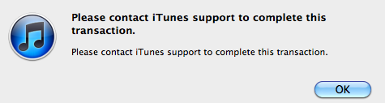

I tried purchasing an application tonight in iTunes, and received the following error:

For Google’s benefit: “Please contact iTunes support to complete this transaction”.

I tried again and again with the same results. Afterwards I tried from my computer and got the same cryptic error message.

I contacted Apple iTunes support tonight, and here was their response:

> Welcome to iTunes Store Customer support. I am Chandan.
> 
> I understand that you are not able to make purchases from your Account. I will surely help you in resolving the issue.
> 
> Apple is currently working toward a resolution for the issue you have reported. You will receive an email after the matter has been investigated and further information is available.
> 
> Thank you for your patience. Apple wants your iTunes experience to be as enjoyable as possible.

So, maybe I’ve stumbled upon a bug? Not sure.