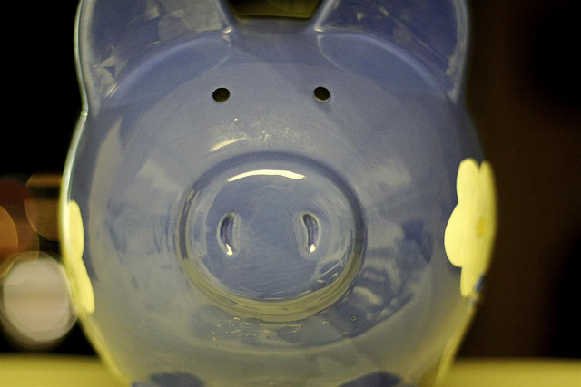

For whatever reason, people keep acting like the only way to do what I’m doing is to be filthy rich. That is the myth I mentioned in my other post about world travel only being attainable for millionaires. Tim Ferris has a great example in his book about some actor saying if he won a million dollars he would take a few months off and motorcycle around Thailand – Tim’s point is that you can do that for probably a few thousand dollars, so no need to gamble that experience on the lottery, just save for six months and then go experience it.

I was just down at Starbucks in Palmero Soho, Buenos Aires, testing out the WiFi. There was a group of four middle-aged individuals from New York sitting on a couch next to me talking in english. So, I said hey (english people here tend to gravitate towards each other), and we started talking. The fact that I’m traveling around the world for a year is a bit strange to them. We are all from North America, a continent where most people work long hours only to get two or three weeks off a year. So their first question to me was how in the world I managed to get a year off to go traveling.

I quickly explained that I’m a partner in a company, and I can work from anywhere on the planet with an internet connection. I could see the screws turning in their heads when I mentioned that, as they were trying to figure out how what I just told them fits into their preconception of people only doing one or two week trips at a time. Once they figured it out, one of the guys asked me if we were looking for a new partner for our company!

He then asked who was bankrolling my adventure, as if someone was subsidizing my trip from back home. I simply said I had saved for it, to which he appeared a bit surprised, and then said “good for you.”

As I’ve mentioned on my personal site, I saved $10,000 prior to leaving Canada, mostly as a safety buffer for the unexpected. To do that, I paid off my car loan, my student loans, my RRSP loan, and started banking cash with the expectation of traveling. My goal of course is to return to Canada with roughly the same amount of money in the bank (or more), so we’ll see how that goes. Since I’m making money as I travel, I don’t really expect to dip too much into that buffer, not unless I hit a snag or purposefully make a purchase (such as a camera) knowing that it’ll decimate my savings a bit.

People then assume that I must have a really high paying job to pull this off. I do alright compared to many people, but in terms of salary, I pay myself about 30% less than I was making when I worked in Vancouver as a Voice over IP engineer. What is different though is I got used to saving money these last few years, and have managed to finally get myself out of debt. That means I’m not shelling out a pile of money that’s going to pay the interest at some bank, and can instead use that money to finance my adventure.

My student loan was around $500 a month, my car loan about $400, and my RRSP loan around $600. You add that all up, and that’s $1,500 a month now that’s free to be used on other things. I’m still contributing to my RRSP while traveling, I’m just doing it out of pre-tax dollars directly from the source, so I never see it. The rest goes into the bank to pay for my excursions.

Because I don’t have a house or an apartment sitting empty back home, my basic cost of living is roughly the same down here – the only real difference is the money I need to spend on flights and excursions. With that in mind, I can afford around $1,000 a month for trips, tours and flights to new places. My trip to Montevideo cost me around $250, and my upcoming trip to Iguazu Falls will run me around $350 (I used points for my flight, so it was a bit cheaper). By the end of February I will have seen two really amazing sites for a rough cost of $600 – we used to spend more than that at the bars and on lunches back home.

I’m hoping to hit Machu Picchu as well in March, and that will probably set me back $800 or so. So most of my budget in March will be used up on one destination. But as it’s an official “wonder of the world” and will allow me to experience some of Peru, it’s money well spent.

While I hit Europe I can hopefully save a bit of money by bunking with the friends I have scattered over the continent. And if not, I’ll do what I’m doing now – renting small apartments here and there for a few weeks at a time.

Traveling the world doesn’t take hordes of cash, just a desire for an adventure and a little perseverance with removing debt and saving for it. Two years ago I was in a pile of debt and almost living paycheck to paycheck – now I’m debt free and traveling the world. So if world travel is one of your dreams, you can make it happen! Just start planning for it today and then follow through on your dream.