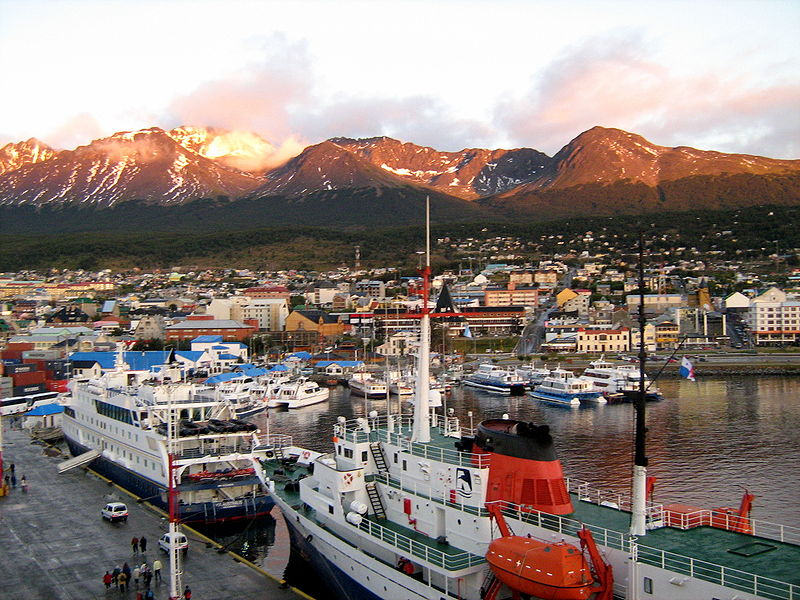
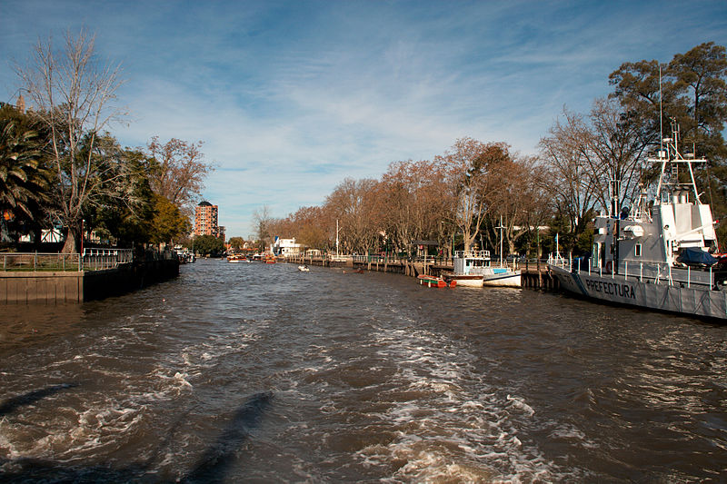

Hard to believe, but at this time about a month ago I was boarding a plane in Vancouver to start my big adventure. I was trying to remember my flight down here, and other than a few moments in the airport and on the plane, I don’t really recall too much of it. Truthfully it seems like a very long time ago already.

I’ve been in Buenos Aires now for 30 days, and have seen quite a bit of it. A month ago I didn’t know how to do laundry, didn’t have a phone here, wasn’t able to order food in a restaurant, and had no idea where the best places were to get money. Thirty days later I have most of those basic tasks in the bag, so things are starting to get easier for me.

I had my last spanish lesson the other day. It wasn’t actually supposed to be my last, today was, but unfortunately I woke up feeling under the weather and was forced to cancel it. All in all I took 16 hours worth of lessons spread out over 3 weeks, and got a lot of practice speaking and trying to get my ideas out. My main problem now is vocabulary – I simple don’t have a large enough one to muddle my way through most random situations. So going forward I’m going to start learning more verbs so that I can talk more about things going on.

The lessons were extremely useful, but as I hadn’t really budgeted for them, they were an expense that was starting to add up. In addition, six hours a week is pretty hard to fit in on top of my day job, and I was finding myself pretty drained in the evenings, and not really that keen on going and doing anything after. So, I’ve suspended the lessons for now, and am going to go back to reading from books and hopefully venturing out more.

### Paying Rent

I paid my second instalment of rent for my apartment yesterday. The final sum was around 4,400 pesos, which took me about two weeks of random bank trips to accumulate. Thankfully the management company came here to pick the rent up, which saved me having to taxi through the city with that amount of money in my pocket. I have my final instalment of rent to pay at the beginning of March, and then that’s it for Buenos Aires. On the 29th of March I’ll give the keys back, and hopefully receive the $1,100 USD back that I gave for a damage deposit.

### Travel Plans

I’m heading to Iguazu Falls in exactly two weeks, and am really looking forward to almost everything about that weekend (comfy bed, hotel pool, meeting some new people, getting soaked during the boat tour of the falls). While I’m enjoying Buenos Aires, I’ve been spending a lot of time at home lately and am anxious to get out of the city. I’m also looking forward to getting on a plane again, which is strange considering I don’t really like to fly. But Iguazu should be a great adventure, and I’m sure I’ll walk away with some great photos of the trip.

There are at least two other trips I was considering: one to Ushuaia, the southern most city in the world (and home of many penguins!), and another to Machu Picchu. While it may be somewhat disappointing, I’m pretty sure I’m going to bail on the trip to Machu Picchu. First, it’s going to be a very expensive trip. Crappy flights start at about $500, and the better ones are around $700 now. It’s a 7 or 8 hour trip to Cuzco from here, which is almost two days worth of traveling. To do the trip \*in a rush\*, I’m looking at four days and a lot of early mornings running around and catching transportation. All to end up seeing Machu Picchu during the rainy season, when it’s likely to be wet and cloudy.

I definitely want to see it, but other than the actual visit to Machu Picchu itself, the rest of the journey doesn’t really appeal to me, especially for how much it’s going to cost me. It’s still not for sure, but I’m leaning in the direction of not going. Given that I won’t have a chance to see Rio either, that might be another future trip worth doing at the same time – Rio De Janeiro and Machu Picchu. So, I’m not too worried if I miss it – it’s not going anywhere. And truthfully, that’s the type of trip that might be better with a friend or two.

The Port in Ushuaia

Instead, I’m actually more excited about the prospect of visiting Ushuaia, arguably the southern most city in the world. It looks like a great town, and it’s situated right at the end of the Andes and also on the ocean. It would also present an opportunity to go and see some real life penguins, which I think would be awesome. It’s almost a four hour flight from Buenos aires, and ultimately about 12,500 kms away from Vancouver, so it would definitely be the furthest I have ever been away from home (and probably ever will, given the geography).

Spending a weekend relaxing and enjoying myself in Ushuaia would probably cost me less than half of what a frantic visit to Machu Picchu would cost me, so it’s honestly sounding like a far better option to me. But we’ll see.

### Tigre

I’m hoping to visit the town of Tigre on the weekend, which is about a one hour train-ride from Buenos Aires. I haven’t been out exploring in a few weeks now, so I’m looking forward to doing something new, and taking in some of the surrounding scenery. If I go it’ll probably be on Saturday; I just need to figure out how the train system works and then hopefully I can make it happen. Other than that, I may try to check out the San Telmo market on Sunday, which is a pretty famous artisan fair in Buenos Aires.

### Thoughts

After a month of living out of a suitcase, there are certain things that come to mind that I will probably do differently going forward. First is medicine. I came here with a half bottle of tylenol and that was pretty much it. I used up my last one a while ago, and simply haven’t had the patience to try and get any more here. Unlike Canada where you can get medicine over the counter in most supermarkets, here you have to go to a pharmacy and go through an elaborate process, even to get aspirin. So when I hit New York City, I’ll probably get a bottle to take with me. Same goes for sedatives – I don’t use them very often, but they definitely come in handy when you’re having trouble sleeping due to a time change and really want to get caught up on sleep.

Dale bought me a nice little travel kit for my Apple products for Christmas. I use it all the time, since it allows me to charge my laptop, iPad and iPhone from an Argentina power circuit (which runs at 220/50 Hz). One thing it doesn’t help with though is the charging of my camera equipment. For that I ventured down to a hardware store a few days ago and managed to buy a Canada-style plug that fits into a power socket here. I can now plug in my camera electronics (all of which can natively support 220/50 Hz) into the wall.

The only thing that would make the process better is having a Canadian style power bar that I can plug in (so conceivably I could charge every single thing I owned at the same time). Given that I still have room in my suitcase, I’ll probably grab one in New York City somewhere.

I’m also going to pick up a cheap NetBook in New York as well. Having two computers does seem a bit like overkill, but taking my top of the line Macbook Pro with me for weekend trips (especially to areas I’ve never been before) isn’t something I’m that keen on doing. So I think having a $300 or $400 NetBook to take for weekend jaunts would be ideal, as it’s functional enough to still get some work done, but not expensive enough that I would be horribly upset if it were to get stolen. Having never used a NetBook, I’m not really sure what to expect. But as long as I can check email, hit websites, SSH into our server, and write code in some sort of text editor, it’ll be a worthwhile device to have around.

I’m not entirely sure why, but I only brought three pairs of socks with me. Thankfully it’s still sandal weather here, but as it starts to cool off I’m going to definitely need to find some more to take with me. I brought more than enough underwear along, so I’m good in that department.

If I were to do things again, I definitely would have brought more US cash with me. While it’s not as prevalent here compared to many other countries I’ve been in, the US dollar is still accepted by many establishments. So having some US cash around is a good strategy to get yourself out of a bind in the event that bank machines are down or what-not. Unlike Canada, very few places accept credit cards here, so you really need to have cash on-hand. I’m not sure what a good amount of US cash would be, but probably something on the order of a few hundred dollars is loose bills to keep in the safe would be a good idea. Once again, something I’ll rectify when I hit New York City.

While it’s still a few months away, I’ll be hitting Ireland shortly after meeting Dale and Sara in New York. I was talking to my friend Andy in Ireland, and we were already planning a little road trip through the countryside in Ireland, which will be great. But I’ll save the Irish planning for end the of March!

So in short, one month down, less than two months remaining here in Buenos Aires.