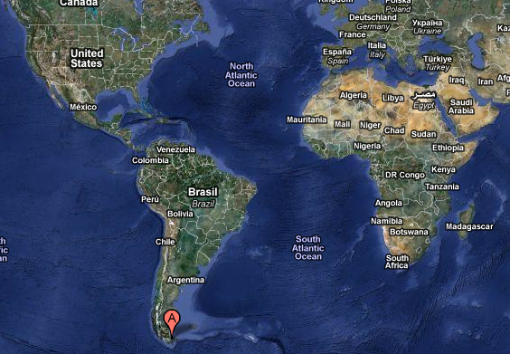
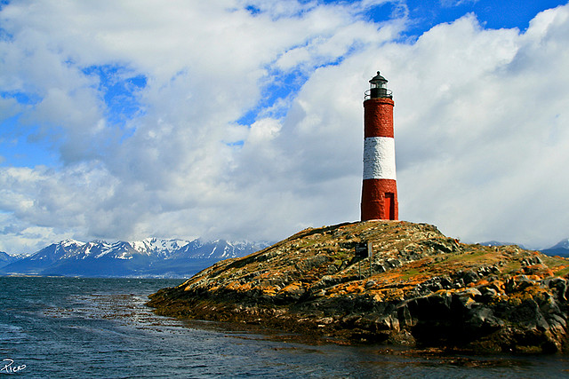

Well, I just did it – I booked a trip to Ushuaia, Argentina, the southern most city on the entire planet. I was originally going to go to Machu Picchu during that time slot, but once I learned that the southern most Irish pub in the world was in Ushuaia and that St. Patrick’s Day would align with the day I arrived, the decision became easy.

As you can see from the above map, Ushuaia is about as far south as you can get on the planet, other than Antarctica of course. In fact, many of the ships that go to Antarctica leave from Ushuaia. If I had more time, I would consider making the journey there, but I’m content on this trip simply to enjoy Ushuaia.

To save a bit of cash I’ll be staying in the [Antarctica Hostel](http://www.antarcticahostel.com/). I picked the Antarctica Hostel because it has stellar reviews online, and most people rave about the time they spent there and the people they met. As I haven’t met a huge number of people yet on my trip, it’ll be nice to randomly run into others and get a chance to hear about their travels. There’s a bar right in the lounge in the hostel, and many people sit around all day chatting, sipping Argentine beer and playing cards, which sounds like fun.

I’ll spend my first two nights bunking with everyone else, and the second two nights in a private room. I purposefully did it that way to sort of gauge what the difference is between the two experiences. So when it’s all done I’ll give my impressions. I think a private bed is more conducive to getting a restful sleep, but the dorm rooms are easier to meet people. So we’ll see.

Fin Del Monde, The End Of The World, Photo By Piffer On Flickr

I’ll be down in Ushuaia from March 17th (St. Patrick’s Day) until March 21st, so four nights. The flight time is about 3.5 hours from Buenos Aires, and I arrive at around 9am on the 17th, just in time to drop my things off at the hostel, do some sightseeing, and then grab my stool for the afternoon at the Irish pub. The hostel has free WiFi, so it’ll be easy for me to stay connected when I get there.

There are penguin tours going on during the month, so I’m hoping to catch a 1.5 hour ferry tour and go to the little island that most of the penguins migrate to during the summer down here. I have to say, seeing a real live penguin will be a pretty great treat, and I hope it all works out. But other than that, I’ll probably do some exploring, some nature tours, and work off some of the dust on my digital camera.

As soon as I get back to Buenos Aires from Ushuaia, it’ll basically be winding down and getting ready to leave, which happens on the 30th. So Ushuaia will be my last big adventure in Argentina before moving on.

I have to say, I’m \*super\* excited to travel down to somewhere as unique as Ushuaia – definitely looking forward to the adventure!