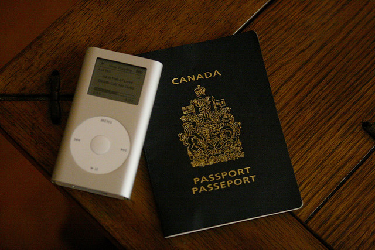

One of the hard parts of traveling around is deciding what to bring with you and what to leave behind. That’s relevant before your adventures, and it’s also relevant while you’re traveling.

Despite Buenos Aires having a relatively high petty crime rate, I spent my first week and a half here walking around with my wallet in my back pocket and basically every piece of ID and financial card in there as well. It wasn’t until I lost my bank card a few days later that I started to really think about the stupidity of carrying everything I have on my person at all times.

So, I’ve made a few changes, and here are the results.

### My Wallet

I’ve basically taken everything of importance out of my wallet and stuck it in the apartment safe. That includes my British Columbia ID, my credit cards, health cards, and the majority of my cash. What’s left is about $200 in varying currency (mostly Argentine Pesos, but also a bit of US cash) and one credit card.

The only reason I really carry a credit card is in case of emergency. For example, about a month ago I was locked inside my apartment for nearly 20 hours due to a faulty lock. Despite being able to get a hold of my landlord and get the process moving, it still took nearly 24 hours to resolve the situation. Had I been stuck \*outside\* my apartment late at night, things could have been pretty dire for me since I didn’t have a working cell phone at the time and had little to no cash on me. As a result, I now carry a credit card in the odd event I need to taxi to a hotel and get a room for a few days.

### My Safe

I keep pretty much everything of value inside the safe when I’m not using it. Most resorts and hotel rooms have safes, and they are just a precaution in case someone were to break into your room or even in the event of a fire. So I keep whatever cash on top of what’s in my wallet stored inside of the safe. I also keep my watch, my pocket sized cameras, all my ID, my travel documents, and my passport. The current safe here is operated by a key code and an override key which I have on my keychain. The first thing I did when I arrived is reset the keycode on the safe, so presumably the current combination is known only to me.

### My Passport

I look at my passport like it’s a solid block of gold. Not only is a passport a relatively time consuming document to obtain, but a Canadian passport is coveted in many parts of the world since it’s one of the most flexible passports around. So I always make sure I know where mine is and that it’s in a secure location.

While I’ve never lost a passport while abroad, I can only imagine the difficulty in obtaining a new one, especially when you’re in an unfamiliar country. First it would involve finding the Canadian embassy, and then working through all the paperwork. They can often issue a temporarily document to help get you home, but then you have to deal with all the hassle at the airport when you try to use a relatively unused type of document. So I go out of my way to make sure my passport is never in harm’s way.

In addition, I also make sure I have a dedicated credit card next to my passport, and enough loose cash for an extreme emergency. In the event that everything I own is stolen (my phone, my wallet, my computer, my extra clothes, etc), the passport, credit card and loose cash should be enough to get me home in a pinch. I have a high enough credit limit that I could expense a first class ticket back to Vancouver from anywhere in the world, and enough cash to pay for a taxi or a limo to the airport should the need arise. Obviously that’s an option of last resort, but I take comfort in knowing that it is at least an option.

Like they say, an ounce of prevention is worth a pound of cure, so make sure you don’t carry anything with you that you wouldn’t be able to handle being lost of stolen, and always have a backup plan with regards to getting home in a pinch.