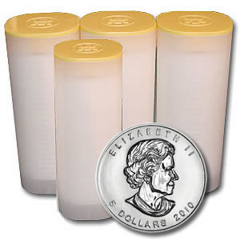

I gotta say, I like precious metals. Maybe it’s because I’ve seen Pirates of the Caribbean one too many times, or maybe I was a gypsy in another life. But there’s something strangely appealing about the shine and lustre of a piece of gold or silver.

Most guys don’t have many opportunities to own any metals. I used to have a gold plated watch, but unless you’re wearing a suit or at a formal event, a gold watch just looks out of place most of the time. My current watch is made of titanium, which is actually a very expensive precious metal, but I like it mostly because it’s extremely light, not because it’s valuable. In fact, had my ex girlfriend not bought it for me, I’d probably still be wearing a cheap $50 Casio or something. But I love the fact that it’s super light and doesn’t look much different from a normal stainless steel watch.

Prior to the invention of fiat money (which is the money we all use now based on paper and backed mostly by an empty promise), people used to pay for products and services using precious metals such as gold and silver. In fact, the US Constitution does not grant the US government the ability to print money, only to issue coinage, which was implied to be gold or silver. So precious metals were once at the core of the world’s financial system.

It’s a good idea for most people to hold precious metals in their investment portfolios. While gold doesn’t really have any industrial usages (other than jewelry), silver is actually heavily used in electronics, so it’s a dual purpose investment. While it’s unlikely that gold will appreciate much on its own, it is a very useful hedge against inflation, since the price of gold inversely tracks the value of currencies – in other words, as currencies go down in value, most precious metals go up in value. So it’s really a way to store value such that it isn’t lost. Given the rampant inflation in most of the world, gold has seen almost 10 consecutive years of growth in value.

Nowadays very few people actually own any physical precious metals, mostly because they are difficult to store. If you want to keep them at home, you should probably have a safe, not only for protection against theft, but also to protect against them melting into a big puddle during a fire. The other option is a safety deposit box, which not many people have.

Right before Christmas I decided to pick up a small amount of physical silver. Unfortunately gold is too expensive right now for the casual investor, but you can pick up a one ounce 99.99% silver coin for around $30 CAD, so it’s relatively inexpensive. I decided to pick up a roll of 99.99% pure Canadian Silver Maple Leafs, which is 25 coins. From an investment standpoint it’s still a very small amount, but I have to say it’s pretty awesome holding a pure silver coin in your hand.

Over the years I’ll probably try to acquire more, probably still a tiny amount from a portfolio perspective, but mostly because collecting coins seems strangely fun at this point in my life. I think it would be cool to get a few silver coins from each year’s collection, and slowly build up an interesting coin collection that doubles as an investment as well.