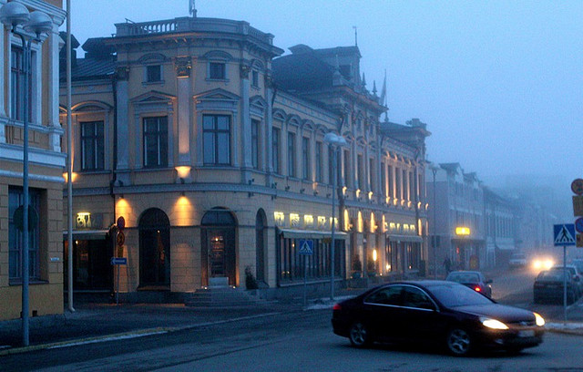

As soon as I leave Buenos Aires, I’ll be heading over to Ireland to visit my friend Andy for a few days. I’m not sure how long I’ll be in Limerick, but afterwards I’ll probably make my way to Dublin to explore that city a bit more. Another friend of mine from Vancouver, Tanya, is probably going to meet me in Dublin for a bit of exploring, so that’ll be fun.

Sometime in June I’d like to make my way to Serbia to visit my friend Milan.

But outside of those two bookends, I really don’t have any plans for Europe. Truthfully, it would be great to meet up with people I know along the trip, but I honestly don’t know who I know in Europe.

So I’m really looking for the following:

1\) Do any of you live in Europe? If so, where do you live?  
2\) If you had three months to bounce around Europe, where would you go?

I think I’ll be forced to spend April bouncing around and possibly bunking with friends here and there, but I’d like to rent an apartment in May and June similar to what I did in Buenos Aires. But where I would live is still up in the air – possibly France for part of it, and maybe Greece for another part. Any recommendations?