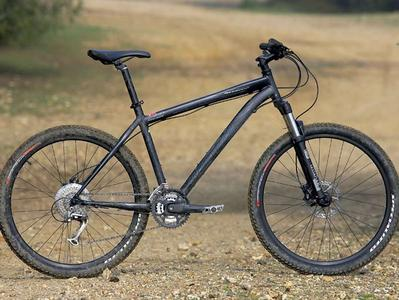

To be perfectly honest, one of the items from my childhood that I miss the most is going for a bike ride. Back when I was about 17 I picked up my first real mountain bike, a Specialized Rockhopper. Compared to most modern mountain bikes, it was a bit lacking – it didn’t have shocks, or fancy XTR equipment, but it was fun to ride and was a fairly modern metal matrix design (at the time). I remember a lot of good memories of hanging out with Jeff and Brennen and heading into the trees for an afternoon of biking. One time in particular we decided to cross the Chilliwack River with our bikes, only to end up being swept about a kilometre down the river while desperately holding onto our bikes – good memories.

Most of my friends these days now have road bikes, and that seems to be more conducive to actually using the bike. Maybe it was because we were so close to nature in Chilliwack, or maybe it was because road bikes simply weren’t popular back then, but almost everyone I knew had a mountain bike. In Vancouver I suspect there aren’t many easy to access places to use a mountain bike, unless of course you live near the Endowment Lands or on the North Shore somewhere. So a road bike probably makes more sense.

That said, as soon as I put down roots again somewhere I think I’d like to get back into biking. I still haven’t decided if I’d go the mountain bike route again or road biking, but I’m open to suggestions.

Maybe it’s because I used to be a mountain biker, but for some reason road biking just seems kind of boring to me. Plus having to deal with traffic seems like a pain in the ass, where typically on a mountain biking trail you’re mostly by yourself and there aren’t many distractions. I have the perfect car to put a bike rack on, so having to drive a short distance to hit the trails doesn’t really bother me.

About five years ago I went down to a bike shop to buy a bike, and ended up grabbing a cheap ($300) hybrid bike – basically a cross between a mountain bike and a road bike. Unfortunately I never really liked that bike, and it was never really ever “in tune”, so the gear shifting was always a bit clunky. And because it was a hybrid, it wasn’t really good at anything – the tires were big by road biking standards, and the bike was under powered for any serious off-roading. So, when I moved back to Chilliwack I gave it to my mom, and I hope she’s gotten more use out of it than I did.

I realize it’s hard to compare road biking to mountain biking, as they are different beasts entirely. But I’d love some feedback from bikers as to what they would recommend, or at least what they are into these days.