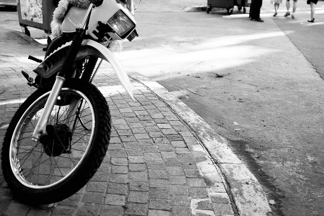
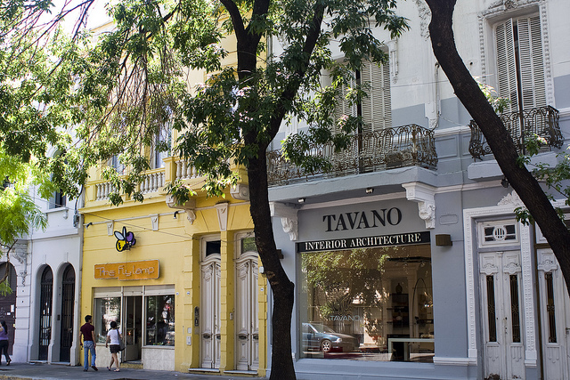
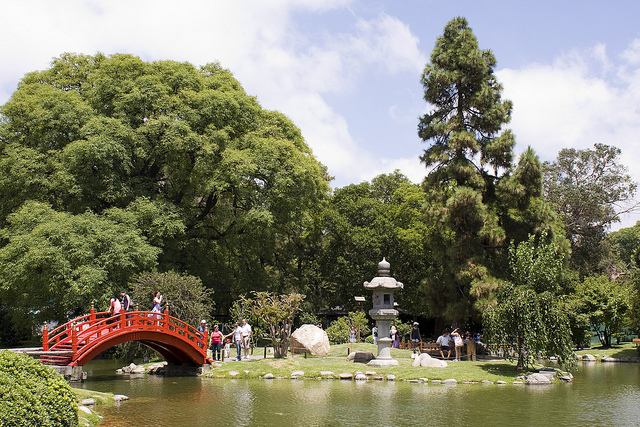

I originally wasn’t going to bring my SLR along at all on my trip, mainly because it would take up a pile of room. As the departure day loomed in front of me though, I just couldn’t bring myself to travel the world with only my point and shoot.

As a compromise I decided to bring along the [Canon EF 28mm f/1.8 lens](http://amzn.to/18O9EsJ), which I bought right before coming. On a 1.6x crop factor it acts more like a 44mm lens, which is close to a standard lens but slightly wider. I was hoping that would be a useful field of view for most situations.

I find it a little long for walking around the city, but it’s decent enough for doing portraits (although I haven’t done any yet). I probably should have brought along a zoom, but I’ve made do with the prime so far.

Anyways, here are a few shots I took today with the lens nearly wide open. It’s actually a decent little lens, even if it’s a little softer than I had hoped.

And a few longer shots:

So all in all, quite a decent little lens. It’s definitely not as sharp as the 50mm f/1.4, and probably not as sharp as the 50 f/1.8, but it does a pretty good job all-around for the price. If you’re looking for another good prime addition to your kit, then definitely check out the [Canon EF 28mm f/1.8 lens](http://amzn.to/18O9EsJ).