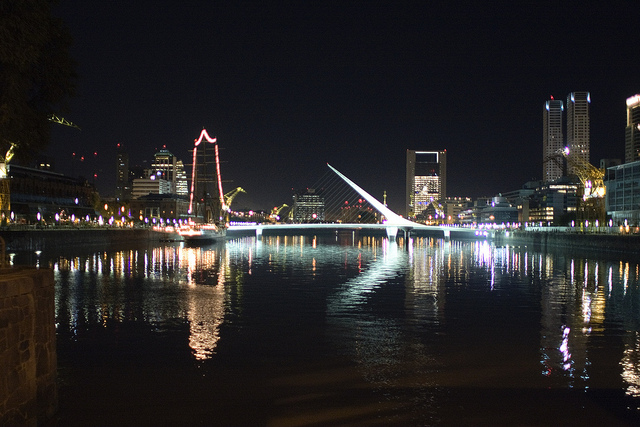
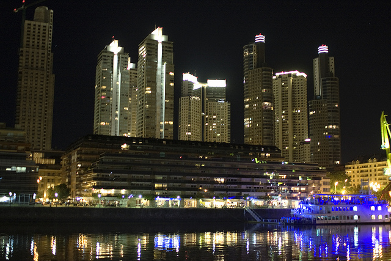
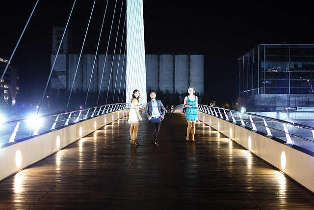

Last night a few of us went down to check out a little party on a boat docked in Puerto Madero. Puerto Madero is the area on the east of Buenos Aires that is one of the newest, trendiest (also, more expensive) areas within Buenos Aires, and is home to a lot of skyscrapers, one of which houses Microsoft’s offices here.

It was the first time I hazarded to take my DSLR out in public, and I’m really glad I did. Truthfully, it’s been great getting back into photography, since I essentially took a few years off when I was in Chilliwack. Here are a few shots.

Puerto Madero Skyline

Puerto Madero Skyscrapers

Cíntia, Andrew and Abby, Puerto Madero