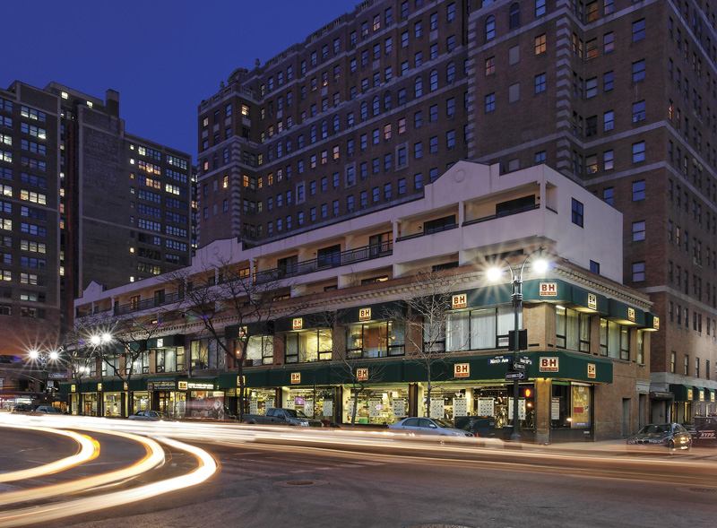

I’ve been blogging a fair deal about my upcoming trip to New York City, and how one of the highlights for me is undoubtedly going to be visiting B&amp;H Photo in New York City. B&amp;H is an extremely well known photography store, and it’s been on my list of places to visit for many years now.

B&amp;H Photo-Video, Photo Supplied by B&amp;H

Thanks to the power of the Internet, Hershel Waldner, Supervisor of the Online Marketing Department for B&amp;H Photo, contacted me and asked if I’d like a private tour of the facilities while I’m there. Obviously, I said yes!

So, I’ll be visiting B&amp;H Photo while I’m in town and also getting a full tour of the behind the scenes action at B&amp;H. I’ll be taking some photos and hopefully some video, and I’ll happily post about my experience when it’s all done.

As I’ve pointed out before, I’m also going to be picking up some new gear while in town. Right now I’m leaning towards picking up a full micro four thirds system and a few lenses, but we’ll see. I may also ditch that idea entirely and pick up either a new lens for my Canon SLR, or a new full-frame body to take with me instead (haven’t decided between a Nikon or a Canon – I’m leaning towards Nikon). So many decisions, so little time.

But I’m very excited to go on the tour, so thanks to Hershel and everyone at B&amp;H for extending this opportunity to me.