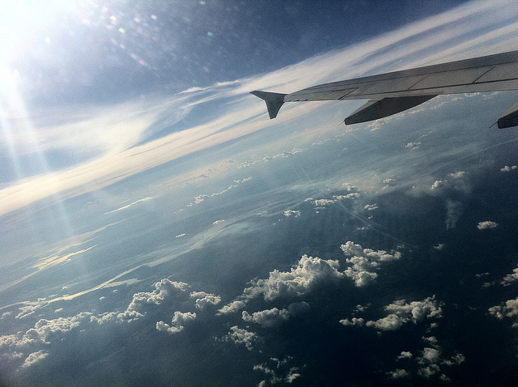
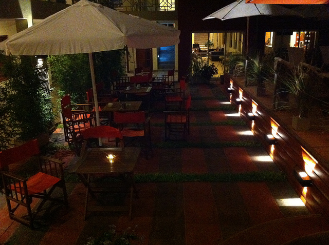
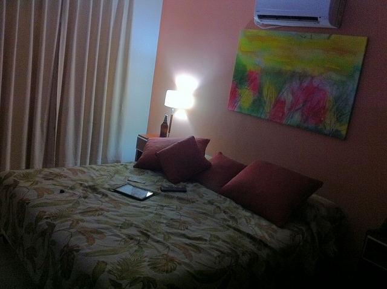
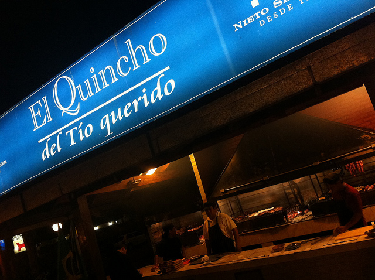
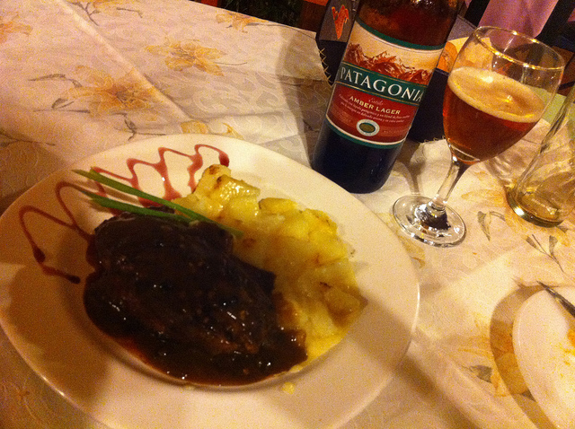
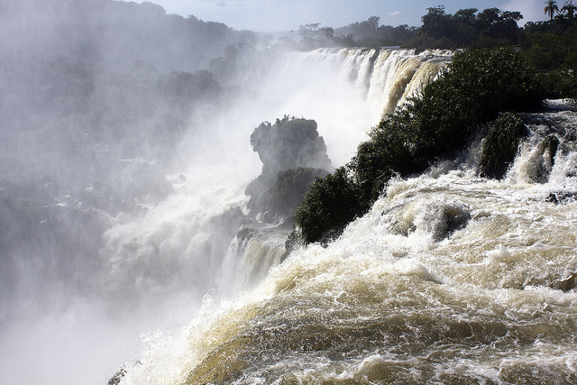
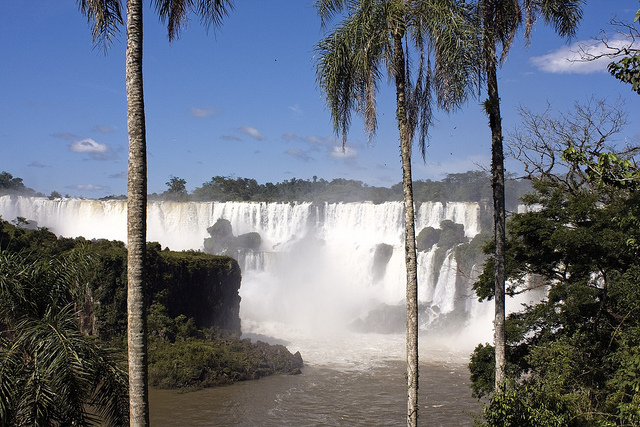
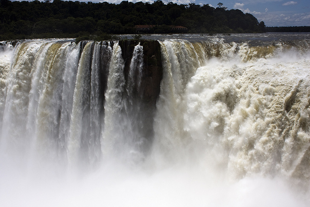

Last weekend I flew up to Puerto Iguazu to check out some of the most impressive waterfalls in the world, Iguazu Falls. Here is a breakdown of my visit to Iguazu Falls in South America.

### Flight From Buenos Aires To Puerto Iguazu

I booked a flight on LAN airlines from Buenos Aires to Puerto Iguazu. Round trip airfare on the weekend is roughly $380 CAD, but thanks to some points on my credit card I managed to get about $300 off, ultimately costing me only $80 or so.

Unlike most international flights, domestic flights within Argentina usually leave from the Aeroparque Jorge Newbury, which is a small airport in Northern Palermo. It was a 30 ($7 CAD) peso cab ride from my apartment to the airport, and took about 10 or fifteen minutes.

Checking in was a breeze, and the line-ups were basically non-existant. Everyone at the counters speaks english, so I didn’t have any issues with communicating (although I did toss in a bit of Spanish).

I had about 60 minutes to kill, so I went and had myself a little pizza in the food fair. Pizza is pretty much everywhere in Argentina, and while I have enjoyed it, I have to say I’m looking forward to have a fully loaded pizza back in North America when I land.

The flight ended up being delayed almost an hour, so I just sat downstairs in the waiting area and casually sipped a bear. We had to then board a little bus to take us to the airplane, which happened to be parked some distance away from the terminal out on the runway. After sitting on the plane for about 30 minutes or so, we taxied out onto the runway and made a sharp left for Puerto Iguazu.

### Landing In Puerto Iguazu

The flight was mostly uneventful, other than about 15 minutes of bouncing as we ascended to cruising altitude. There was a thunderstorm in Buenos Aires earlier in the day, so I imagine the bumpiness was due to that.

Puerto Iguazu is a small, quaint little airport, and the runway also doubles as the taxiway back to the terminal. The airplane parked on the tarmac, and the stairways were brought up to the plane so people could disembark.

Since I didn’t check any luggage, I was able to walk out of the terminal in less than about 60 seconds. I quickly located the minibus service to Puerto Iguazu, paid my 20 pesos, and actually got the last vacant spot on the bus. The trip to Puerto Iguazu took about a half hour or so, and the bus stopped periodically to drop people off at various hotels.

### The Hotel Jardin de Iguazu

I googled for a nice hotel in Puerto Iguazu, and ended up settling on the [Hotel Jardin De Iguazu](http://www.jardindeiguazu.com.ar/) (the #2 hotel in Puerto Iguazu based on TripAdvisor reviews). It’s a nice little boutique hotel that’s centrally located, and it was a great location to hit the bus the next day as well as check out some of the restaurants in the area. It’s actually somewhat smaller than the photos make it look, but it was still very comfortable.

The room was very cozy, and the air conditioner was whisper quiet compared to the one back in my apartment in Buenos Aires. As a result, I slept really well in Iguazu and managed to get caught up on sleep.

Some people on TripAdvisor complained that the people at the front desk didn’t speak much english (really though, why should they?). I found that between my broken Spanish and the english at the front desk that I was more than able to communicate. Everyone was really welcoming at the desk and made the stay enjoyable.

One aspect of the hotel that was new for me is that you have to give your keys to the front desk whenever you leave. I Googled it as soon as they told me that, and it turns out that’s a pretty common practice over in Europe. As soon as you come back you simply give them your room number and they hand you the keys. Strangely enough, they don’t really do any sort of security validation or ask for ID. I walked up, asked for the keys to room 101, and they simply handed them to me each and every time. Maybe it’s a practice from a simpler time when people didn’t have to worry about theft. It was a nice change though, and I thought it was a pretty neat practice. I had everything of value in the hotel safe, so I wasn’t worried in the least.

The cost of the hotel was around $110 USD per night, and that included a nice pastry-based buffet breakfast along with coffee and juice.

### Dinner

I was really craving a good meal my first night in Iguazu, so I walked down the street to El Quincho, one of the better restaurants in town. I ended up ordering a steak in black pepper sauce, which is one of the first times I’ve had steak in a sauce in Argentina. It was a welcome change from the other steaks I’ve had, and was definitely a very enjoyable meal. If you go with more than one person, they also have a really great parrillas, so check that out.

With a nice big bottle of Patagonia beer, the meal came to about 110 pesos (around $27 CAD or so). Definitely expensive by Argentine standards, but worth the price considering how nice it was.

After dinner I went and watched some TV (True Lies was actually playing in English, and it was nice to watch some English TV for a change), and then hit the sack with the intention of getting up early.

### Bus To The Falls

I woke up around 8am, and headed down to the front desk area to have breakfast. I filled up on tasty pastries, and then made the 5 minute walk to the main bus station in Puerto Iguazu. I bought a return transfer for Iguazu Falls for a price of 20 pesos (around $5 CAD). I then hopped on board the bus, grabbed the rail (since there weren’t any seats left), and held on for dear life.

I gotta say, people drive crazy in Argentina. I grew up with friends who were also crazy drivers, so it doesn’t really scare me. But I can why people are afraid to get into cars here. First, the lines on the road seem to be more like suggestions than rules. Very often you’ll see three cars side by side in a space meant for two cars, and wonder how in the world they don’t touch. Cabbies seem to always have their hand on the horn, and aren’t afraid to use it when other people come within an inch or two of their car. Strangely enough, traffic moves along at a good pace and I haven’t seen any accidents. But if you’re afraid of driving like that, best to pop an ativan or two before getting in a vehicle here.

The bus picked up a few more people along the way, and after about 30 minutes we arrived at Iguazu Falls. The entrance fee was 100 pesos ($25 CAD), which was reasonable considering I spent five hours there. If you want to come back the next day, just make sure you get your ticket stamped and you’ll get in for half price.

### Journey To The First Falls

I didn’t sign up for any dedicated tours, which meant I was on my own for the falls. In general, I’m not a huge fan of guided tours as most of them are heavily commercialized and often go at a snails pace. I did the entire falls in five hours, which was a leisurely pace for me – I heard stories of other tours lasting more than eight hours, and I really don’t know how you could stay that long there.

Unfortunately because I didn’t do a guided tour, I didn’t really have a map of the complex. There were a few billboards with maps, but none of them seemed to have a “you are here” icon, so I had a hard time getting my bearings. I ended up walking into a train that every one was getting on, so I figured I would go along for the ride. As it turns out, that was the right thing to do, as that train takes you from the entrances gates to the various trail heads that lead to the falls.

### Superior Trail

Access to the falls are along various hiking trails. The three main ones are the Superior Trail (which takes you along the upper falls), the Inferior Trail (the lower falls), and the trail to Garganta del Diablo (the devil’s throat). I started with the superior trail.

As you walk along the superior trail, you can start to hear the sound of rushing water. I was pretty astounded when I got my first glimpse of the falls, and realized I basically was smiling ear to ear. It’s strange to look at a site in Argentina on Wikipedia and suddenly end up in that very spot a few months later.

It’s actually an engineering marvel just how close you can get to the falls. Most of the walk ways are literally over the edges of where the falls start descending down the cliffs. I assumed you would be able to walk pretty close to the falls, but never did I imagine that you’d actually get to walk \*on top\* of them. Definitely cool.

### The Inferior Trail

The inferior trail takes you along the bottom of the falls, and provides a few vantage points for some nice panorama shots. They also give you a pretty clear look at the trails and boardwalks that make up the superior trail.

You can also get pretty close to the falls on one part of the inferior trail, so I decided to go the distance to see just how wet I could get. I turns out you can go from zero to completely soaked in about 5 seconds, which is what happened to me.

I had my iPhone in my pocket wrapped in a garbage bag, so I wasn’t worried about it getting soaked. But my main digital SLR wasn’t wrapped up, and it was pretty much covered in water after walking to the edge of the falls. It’s been wet before, so I knew it would be fine, but the glass on my lens was wet and I had nothing dry to wipe it off with. It basically meant that I had to wait almost 30 minutes until some of my shirt was dry enough to clean the lens off.

### Gargantua del Diablo

While the entire falls are spectacular, the very last bit of the tour (depending on what order you visit the falls in) is Gargantua del Diablo, *The Devil’s Throat*. To go there, you have to board another train and ride of about seven minutes or so. It’s a fun little adventure, and it takes you through the trees and a bit of the jungle.

The only downside to the train is the long queue to get on the train. The trains come about every 20 or 30 minutes, so waiting in line can be a bit uncomfortable when it’s hot outside. Thankfully they can fit quite a few people on the trains, so I never had to wait more than one queue, but there were a few other people behind me who didn’t make it on when the train came, and in their case it was more like a 45 minute wait.

Once you leave the train, you have about a 10 or 15 minute walk along the little water bridges to get to the falls. You don’t really realize it at the time, but you’re walking right on top of the same river that eventually forms some of the falls for the inferior and superior trails. It’s a bit of an engineering marvel that they’ve constructed walkways all the way from the train, over water, to the Devil’s Throat.

Without a doubt, it’s absolutely amazing being right at the edge of the waterfall and watching it tumble over the edge. Everyone got absolutely soaked from this vantage point, but it was well worth it. Here’s a little video I shot of the Devil’s Throat.

### Back To The Town

I lucked out heading back to Puerto Iguazu in that I caught every train at Iguazu without any waits. I also basically walked onto the return bus in the parking lot, so I was back to the hotel in no time. After a brief swim I ended up passing out on my bed for a couple hours, and then went for another round of dinner. The next morning I woke up, got a shuttle to the airport (for 20 pesos), and caught my flight back home (which was unfortunately almost three hours late).

If you are in Argentina, then you absolutely must see Iguazu Falls. My flight cost around $380 CAD, and the hotel was another $220 CAD. Factor in about $100 for discretionary spending and the total trip was around $700 for the weekend (or $400 in my case since I used some points). Given that it’s routinely ranked as the #1 waterfalls in the world, it was definitely money well spent in my opinion.

I’ve been posting a lot of videos and photos on my Facebook page, so [follow along there for updates](http://www.facebook.com/migratorynerd) as well.