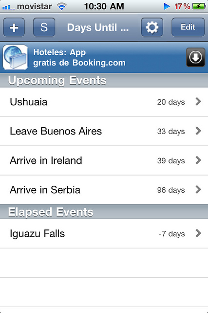
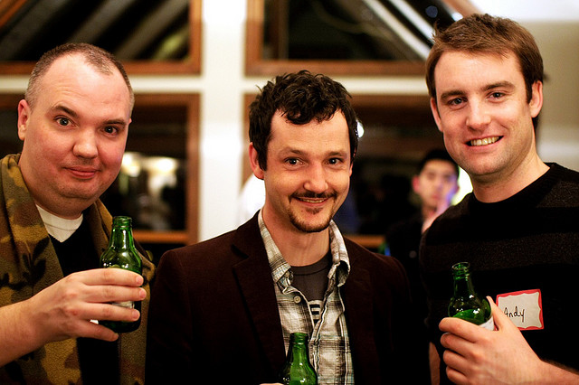

Last weekend I flew up to Puerto Iguazu and checked out Iguazu Falls. It was a great trip, and it was nice to get out of town for a few days. Puerto Iguazu reminded me a lot of Tofino actually, without the surfing. It was a quant little village with only a few main streets. The people were friendly, the food was good, and there were less bars on the windows and graffiti than here in Palermo Soho in Buenos Aires.

The WiFi in my apartment (which is shared between about six suites) has been really dodgy lately, so I’ve moved over to a little coffee/pizza shop across the street. The photo pictured above is a café doble (a double coffee) with cream. The cream they use here is one step away from pure butter, and it’s oh so good. Imagine Tim Hortins on a cold day, but on crack, and that will give you an indication of how good it is.

I’m going to be doing a little post soon about all the iPhone/iPad applications I’ve been using while traveling, but I wanted to point one out that I look at from time to time. It’s called *Days Until* and it simply shows you a list of days until you’re going to do something.

One thing that I like about it is that it shows a little countdown bubble on the application when it’s in the springboard, so you can easily see how many days you have left until that event. The only crappy thing is that little bubble doesn’t update on its own, you have to open the application (I imagine it was written before iOS allowed multitasking applications). But it’s no big deal, you simply open it from time to time and it updates everything.

Right now I’ve been using it to countdown my trip in Buenos Aires, and also for all the little side trips I have planned. For example, the next trip is 20 days away, and it’s to Ushuaia, Argentina.

According to that little widget, I’m only 33 days away from getting on the plane and heading to New York City. In New York City I’ll be meeting up with my business partner Dale and his girlfriend Sara. Both Dale and I have been to New York City before, but Sara hasn’t, so I’m looking forward to doing some of the tourist attractions again to see what Sara’s reaction is to them.

Five days after arriving in New York City I’ll be heading to Newark airport and boarding a plane for Ireland. Surprisingly the 6 hour flight to Ireland is going to seem like peanuts compared to the nearly 15 hours of flying I have to do to get to New York City from Buenos Aires.

I recently talked to my friend Andy in Ireland, and we’ve started making plans for Ireland. Given I’m going to be jetlagged anyways, I’m probably going to take Thursday and Friday off when I arrive and just relax in Limerick, Ireland. It’s my birthday on April 7th and Andy’s birthday on the 13th I believe, so somewhere in there we’ll find time to drink a few beers. I actually think there’s a mini party for him on the Saturday, so I’ll obviously be going to that.

I’m not entirely sure how much time I’ll spend in Shannon or Limerick at this point. In fact, I think Europe will mostly be comprised of a bunch of planning at the last minute.

John, Dale and Andy at WordCamp Whistler

Andy is heading back to Vancouver on the 13th, so we only have a few days to hang out. I think the plan is to go on a little road trip through Ireland for a day or so, something I’m definitely looking forward to. Hopefully by then I’ll have a new camera, or at least some new gear, and what better way to test it out than on some of the Irish landscapes.

And from there, I really don’t know where I’ll end up. Considering I arrive in Europe mid-month, renting an apartment probably isn’t an option. So I’m thinking about heading up to Scotland for a week, back to Dublin to meet a friend for the weekend, and then hopefully across the water to the London area (where I already have a couch waiting for me, at least for a few days). Once May 1st hits, getting an apartment is likely easier, I just have to decide where it is I want to live for that first month. I’d like it to be close to an airport so I can check out a few other places on weekends, but other than that I don’t have any huge constraints.

Milan in Vancouver

My current plan is to be in Serbia starting in June sometime. I’ve been promising my friend Milan a visit for a long time, so this is the trip where I’ll make it happen. Milan has been telling me that if I show up in the summer he can basically guarantee that I’ll never want to leave, so we’ll see what Serbia is all about!

[ExitFest](http://www.exitfest.org/) is the second week in July, and he’d basically shoot me dead if I missed that while on this trip, so that’s on the agenda too. ExitFest is a huge music event consisting of approximately 100,000 people in an old castle.

The only downside to Serbia is the place I would be going to doesn’t really have a major airport. The nearest airport is Belgrade, and it’s not really a huge hub for anything. But if Milan is right, I’ll probably have no thoughts of leaving while there.

In terms of Buenos Aires, I really only have four weeks left here. The last few days I’ll be packing, cleaning and migrating to a hotel for my last evening here. Until then, I still have a lot I need to see. Here’s a rough list (mostly for my benefit):

- See a tango show somewhere
- Visit the San Telmo market on a Sunday
- Do a day trip to Tigre
- Visit Congresso and see the Casa Rosada (Argentina’s “White House”)
- Eat more steak

I also have my upcoming trip to Ushuaia for St. Patrick’s Day, which is going to be a lot of fun. It’ll be the first time since my visit to New York City years ago that I’ll be staying in a hostel, so hopefully the experience is a bit better. But since this time around I’ve opted for a private room and the hostel serves beer in the lounge, I suspect it’s going to be A-OK.