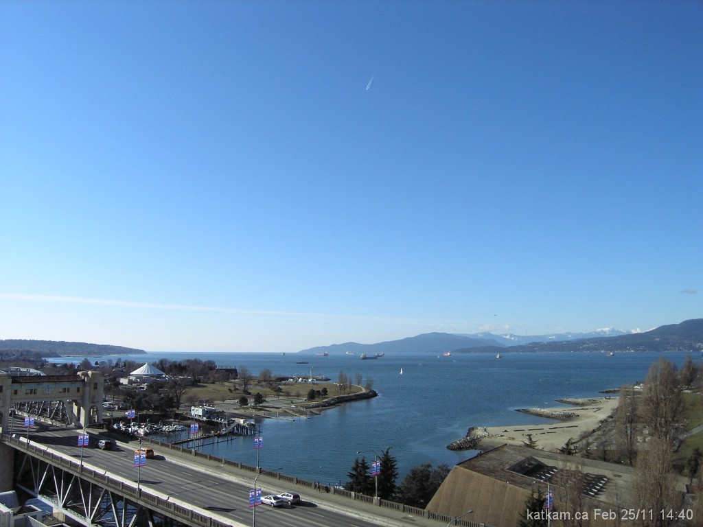

Observe this photo from the [KatKam](http://www.katkam.ca):

If you look closely, you can see some kind of flying object in the sky. I can only assume it’s an airplane, but it looks like it’s flying from the top of the photo down to the bottom.

As a kid, I used to think every time I saw an object like that that it was the Space Shuttle. As an adult, I now know that the Space Shuttle doesn’t fly every day like I thought it did as a kid. But I guess that has to be a normal commercial plane and the fact it looks like it’s flying strangely is just due to the curvature of the earth.

But then I have to ask, why doesn’t the ground ever look like it’s moving strangely like that when in an airplane? Is it because we can only look out the sides of the plane and not the front or back?