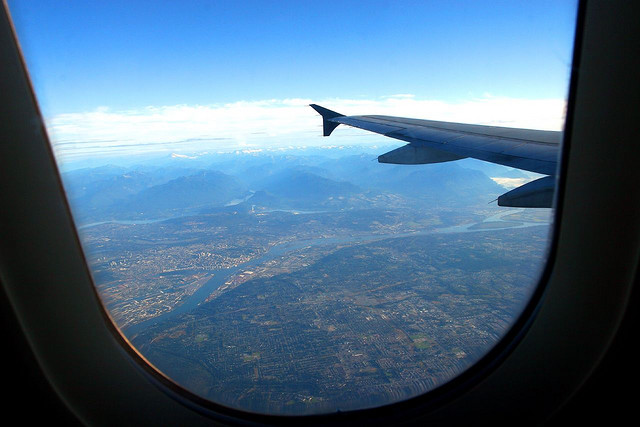

It shouldn’t be a huge surprise based on the previous few entries, but I’m starting to get a tad restless in Buenos Aires.

Unlike Canada where the WiFi is generally reliable, the WiFi here is pretty spotty, which makes it hard to get out of the house to work. The last week and a half it’s been absolutely terrible, with constant drop outs and complete blackouts for an hour or more from time to time.

Back home, I would often go to Starbucks to break the day up a bit, but the WiFi at the nearest Starbucks has been down about 50% of the time I’ve been there, and none of my e-mail works for some strange reason when I’m on theirs. There are a few other coffee shops around, but they all have pluses and minuses as well. So needless to say, I’m getting a bit of cabin fever working from my apartment all the time, and there’s unfortunately not too much I can do about it.

My friend Natalie did a post the other day about her [thoughts about Buenos Aires](http://nataliesisson.com/22-reasons-to-love-and-hate-buenos-aires-and-argentina/). I’ve talked to her about it in person once or twice, and we’re of a similar opinion. While it’s a great city to visit, it’s a difficult place to run a business from. Here are a few bites from Natalie’s post (but you should read the entire post):

> I have to admit that my initial thoughts about Buenos Aires and Argentina have changed quite a lot. Despite what I thought, this is third world baby – as my Argentinian friend likes to say.
> 
> This means I’ve had more frustrations than moments of joy and my patience is running low right now. Even my sister agrees. In trying to find a battery for her Sony Camera yesterday she went to an official Sony store – did they have them? No of course not.
> 
> When trying to get a cream for some bug bites at a pharmacy she got told they couldn’t help and she should go to the hospital!

As an example, I’ve tried for a few weeks now to mail a document back home, but haven’t been able to find a Correo (the little mail office) anywhere I’ve looked. There’s the main post office on the other side of town, but line-ups are rumoured to be hours long, so I haven’t even bothered. FedEx apparently works well, but it’s $50 USD to get a letter sized envelope to Canada, and from their website it looks like I need to sign up for an account and fax something in before they’ll even open it. Based on all that, I’ve simply decided to deal with it in New York when I arrive.

In terms of getting out of the city, the sheer size of Argentina makes that difficult. All the places I’d like to visit are 20 hours away by bus, facilitating the need for overnight transportation. I’ve actually been debating that, just to get out of Buenos Aires for a few days, but haven’t pulled the trigger yet. Flights work well, but foreigners pay almost twice the rate as locals here, so a 1.5 hour return flight to Mendoza costs around $400. Since I’ve already committed to going to Ushuaia in a few weeks, I don’t really have the budget to spend another $400 just to get out of town for a few days.

I still want to visit the little city of Tigre, but it’s more of a weekend trip. I’ll probably try and fit that in this upcoming weekend.

Dale’s all booked for New York City, but Sara has a few things going on at home so she won’t be coming along. So, it’ll be a boy’s weekend. Dale’s birthday is actually tomorrow and mine is right around the date of my New York visit, so Dale and I will go have a few celebratory beers and a nice meal somewhere one day.

I’m actually looking forward to buying some new clothes and doing a refresh on my wardrobe in New York. I’m not sure why I brought the clothes I did, but I’m finding there are only a few shirts I’m consistently wearing, with the majority of my clothes staying in my closet all the time. So I’ll probably mail those ones back home from New York, and replace them with a few more casual items prior to heading to Ireland.

In the last six months I have had to move my belt three holes due to the fact I’m slowly shrinking. I’m currently on the last hole, and I’m about a week or two away from the point where I’ll probably need a new hole. So I need to pick up a new belt in New York City, and maybe a new pair of jeans as well.

In short, there are only about four weeks left in my time in Buenos Aires. I’ve had a great time here, and have another big trip to Ushuaia coming up, but I think I’ll be ready to leave when the time comes.