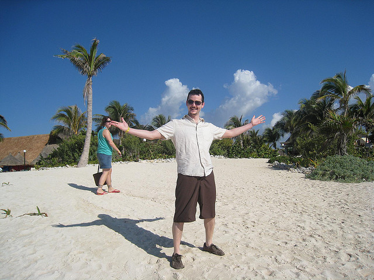
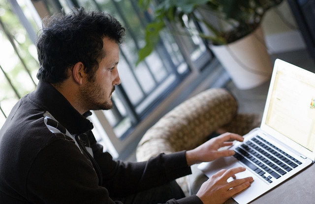

Well, it’s officially midnight in Buenos Aires, which means I can start wishing happy birthdays. Today of course is Dale’s 31st birthday. Dale is not only a trusted friend, but the second (and arguably less good-looking) half of BraveNewCode, the company that Dale and I both own.

The last few years have had ups and downs, seeing me move from Vancouver, to Chilliwack, and now to Argentina. Amongst all the turmoil, there have been only a few constants, and Dale has been one of them. For the most part, I have talked to Dale nearly every day for the last few years, sometimes about politics, about life, about our company, and about our future goals. It’s been a great ride so far, and I’m thankful Dale has been along for the ride.

I would have loved to have sent Dale a present, or at least a card, but unfortunately I’ve spent nearly four weeks trying to figure out how to mail something from Buenos Aires, with no success. So, he’ll just have to settle for tickets to a Yankee’s game in New York City, something I’m working on as we speak!

And on that note, happy 31st birthday buddy – see you in the Big Apple.