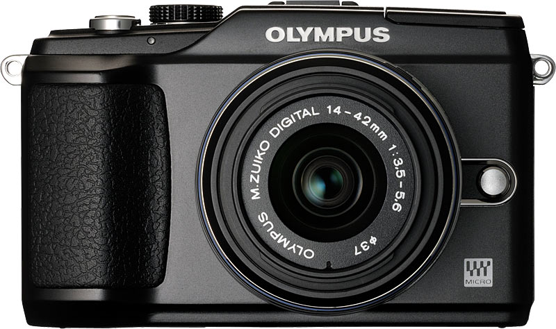
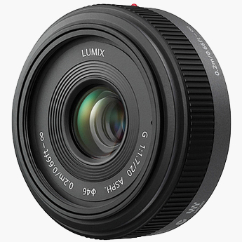

I’ve been blogging about buying a new camera for quite some time now, and I’m pretty sure I have it narrowed down. Unfortunately, buying a camera at this point is a compromise for me, and I have a hard time making compromises in the technology sphere.

SLR cameras and lenses are heavy. They are hard to carry, hard to pack, and a pain to take from place to place. But if you want high-end image quality, than a SLR offers you the best of the best. I love my SLR, but my Canon 40D SLR is in need of replacement at this point. I sold most of my lenses last year, so I don’t really have any professional grade equipment any more. To buy a full frame Canon camera would run me about $2,400, and a decent L-series zoom lens another $1,400. So, unless I’m willing to drop $3,800 in New York City (I’m not), a new DSLR is out of the question.

On of my reasons for wanting some new gear is because I only have a 28mm lens with me on my trip. On a 1.6x crop factor camera like the 40D, that acts like a 44mm lens. It’s not bad for random shots, but it’s not very wide. So whatever I buy will hopefully allow me to take some wider angle type shots.

Given that a new DLSR is out of the question due to costs, the micro four thirds system is very appealing to me since it has high-quality and is easier to pack around. So here’s what I’m probably going to buy in New York City.

### Olympics E-PL2

Micro four-thirds cameras have a sensor that’s a lot larger than a normal point and shoot camera, but slightly smaller than the APS-C sensor in my Canon 40D. That means you get better image quality than a normal point and shoot, but not as nice as an entry level DSLR. It’s pretty close to an entry level DSLR, but not quite there. But the quality is definitely a big step up from most point and shoot cameras.

Compared to a DSLR though, a micro four thirds camera is quite a bit smaller. So the trade-off in image quality gains you a reduced size camera body which is easier to carry around.

The Olympus E-PL2 is one of the newest micro four thirds cameras on the market right now. If you buy it with the kit 14-42mm kits lens it’ll run you around $599 USD. Unless something comes along to change my mind in the next 25 days, that’s the camera I’ll be buying.

### Olympus 14-42mm Kit Lens

The Olympus E-PL2 comes with a new and improved kit lens that has a focal range of 14-42mm. In the 35mm world, that’s equivalent to a range of 28-84mm, which is a really great range for a zoom lens.

That said, it’s not really a very fast lens, and has an aperture of f/3.5 at the wide end and f/5.6 at the telephone end. Since I’ve spent the last three or four years using professional L-series lenses with an aperture of f/2.8 over the entire focal range, this lens is undoubtedly going to disappoint me in terms of quality and usability. But the zoom will provide me with more opportunities to take photos than simply walking around with a 44mm lens on all the time. And really, you can’t really compare the image quality for a $250 lens to one that’s $1,400. So it is what it is.

### Panasonic 20mm f/1.7

The one lens that seems to always be mentioned in every article I read about micro four thirds is Panasonic’s 20mm f/1.7 lens. Of the prime lenses at the wide end of the spectrum, there are currently the 14mm f/2.5, the 17mm f/2.8 and the 20mm f/1.7 lenses.

The 14mm has really great reviews, and f/2.5 is a relatively fast lens. The 14mm focal length acts like a 28mm lens on a micro four thirds body, which is a typical wide angle lens on a full frame body. While f/2.5 is fast enough for outdoors and moderate light situations, it’s not a very useful aperture for taking photos in low light conditions. That said, the image quality gets great reviews, so it’s a good lens to have.

The 17mm is appealing because it’s basically a 35mm lens on a micro four thirds body. When people say “a 35mm camera”, they are referring to old cameras that came with a fixed 35mm lens 35 mm film in them. But, a 35mm field of view is a very popular format, and many of the “retro” cameras coming out (such as the [Fujifilm Finepix X100](http://www.finepix-x100.com/)) have that same focal length. The aperture is fast, but not really fast enough for low-light shots. The 17mm would be the lens I would get in my ideal world, but unfortunately the main complaint people have with it is that they expected the image quality to be better.

And now we come to the 20mm f/1.7 lens. First off, an aperture of f/1.7 is a fast lens. It’s slightly faster than the Canon and Nikon 50mm f/1.8 lenses, but a bit slower than the more expensive f/1.4 variants. So this is definitely a lens where you can take low-light shots indoors. It’s also arguably the sharpest micro four thirds lens around at this point, which is extremely appealing to me (I’m a sharpness whore).

So, right now I’m planning on picking up a 20mm f/1.7 lens as well. If you add it all up, I’m looking at around $600 USD for the body and the kit lens, and another $350 USD for the 17mm f/1.7 lens. Once tax is factored in, it’s a cool grand worth of camera.

### 2013 Update

The Olympus E-PL2 was a great camera, but I’ve recently upgraded to the [Olympus OM-D E-M5 camera](/reviews/products/olympus-om-d-e-m5-micro-four-thirds-camera-review/) which is probably the best camera I’ve ever owned.