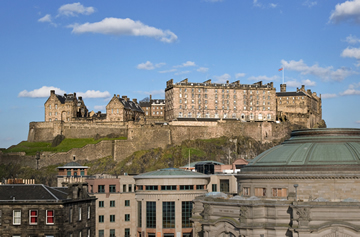

As many people know, I’ll be heading to Europe right after my trip to New York City. I officially arrive in Ireland on April 6th, and will be spending the next few weeks around the United Kingdom.

Europe is expensive, there’s no doubt about it. Most hotels are around $150 a night for anything decent, and many hostels get bad reviews for what they charge. Since I’ve been living pretty cheaply in Argentina, I’m going to live it up a bit in April.

Ireland was definitely on the schedule, as was London (briefly, as I’ve been there before) and Paris. But given that I had a full week to kill in the area prior to Dublin, I thought I would head north and visit Scotland.

I’m flying from Shannon to Edinburgh at the start of the week and then from Edinburgh to Dublin at the end. Together those two flights are around $180 CAD total, a bit more than usual because I’ll need to check a bag. I found a great five star hotel on Hotwire on sale for $120/night, so I grabbed that for the week. So already I’m up to nearly $700, but I’ll get to see one of the nicest cites in Scotland, and also get to get a few great nights of sleep.

The hotel is the [Sheraton Grand Hotel and Spa](http://luxuryscotland.co.uk/sheraton/), and it’s right in a great part of the city for exploring (next to a castle I might add).