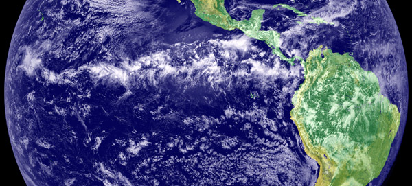

On my original flight from Houston to Buenos Aires I commented on the fact that we hit some turbulence near the equator. It was probably about 2am for me and I was a bit groggy from ativan, so I didn’t really take too much notice. But I thought at the time that it may be related to crossing from the nothern hemisphere down to the southern hemisphere.

Clouds in the ITCZ, Photo from Wikipedia

Sure enough, there’s a region of unstable air around the equator called the [Intertropical Convergence Zone](http://en.wikipedia.org/wiki/Intertropical_Convergence_Zone) which often causes turbulence for flights crossing between the two hemispheres. Sometimes the turbulence isn’t so bad, but I’ve read reports of some flights having nearly six hours of turbulence on crossings.

When I hit the open skies again in about two weeks, I’ll hopefully be able to sleep through the transition. I actually have a little vial of “happy traveler” pills, including a few anti-anxiety pills (ativan) and some melatonin to help me sleep.