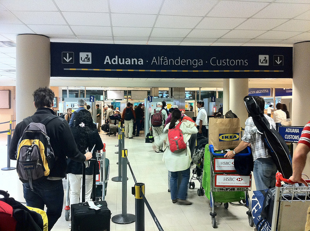

I’ll probably do a summary post on Buenos Aires the night when I leave, but this is my last weekly update from Buenos Aires.

My little widget says that I’m leaving my apartment in four days, at which point I’ll be migrating to a hotel for my final night. I’ve been trying to get my landlord to commit to a time to do the final walkthrough so I can get my damage deposit, but he hasn’t responded to me. I’m not worried, since I do hold the keys and he can’t really rent it until he gets them back from me. But it would be nice to have that all in place for peace of mind. I’ll send another email in a few days and follow it up with a phone call.

The apartment I’m in has worked pretty well. The only downside (and it’s a pretty big one) is that my landlord has been turning the suite under me into a coffee shop. That’s meant three months of construction noise – lots of hammering, banging, drilling, etc. I sent one email to him after a few really noisy days letting him know I was upset about the noise, and of course, he selectively ignored it. The other day the construction guys starting going at around 7am, which woke me up. So once again I sent him an email telling him that 7am construction wasn’t really cool when he had a paying tenant upstairs. No reply again. I posted in the expat forums asking if that were normal around here, and they said while there’s not much recourse for noise infractions, that most tenants wouldn’t put up with it. So I’m not out of line for being upset about it.

I don’t want to rock the boat too much before getting my damage deposit back ($1100 USD), but as soon as I have it in my hands I’m going to let him know that I was pretty upset with the whole arrangement. I hate using my blog for negative purposes, but I have no problem doing a review of the companies involved when the time comes to steer people away from landlords that don’t really care about their tenant’s stays.

Henry is flying in from Chile tonight, and we’ll probably spend the weekend exploring Buenos Aires a bit. Henry has a few things he wants to see, and I’m up for some new adventures. So this weekend will undoubtedly be jam packed without a lot of time to spare.

I’m in a really nice hotel on Tuesday night, and then heading to the airport on Wednesday. I always like taking the day/evening before a big flight easy, so I’m just going to lay low in the hotel that evening and probably make use of the pool and hot tubs.

My flight leaves around 9pm on Wednesday, so I have to be at the airport well before. In fact, I’m probably going to try and be at the airport around 4pm or 5pm. There are many reports of three hour lines at the airport, and rush hour can be unpredictable as well (some people have said it takes two hours to get to the airport during weekday rush hour). So, I would rather have time to kill at the airport than be stressed out trying to make my international flight (that only happens once a day – if you miss it, you’re there until the next day). So that means leaving downtown Buenos Aires around 2pm or so, which is the time I’ve booked my private taxi for.

I’m actually really excited about hitting New York City and soaking in North America for a few days. There are many great things about Buenos Aires and Argentina, but many of the comforts from back home simply don’t exist here. For example, there are no mega-electronics stores like Future Shop here. Even if you walk into a mom and dad electronics store, you’ll pay probably twice what the same item is worth back in North America, so keeping up to date with technology is almost impossible here.

I’m also looking forward to hitting a pile of New York restaurants. Food here isn’t bad, but there’s a real lack of variety – almost every restaurant has the exact same menu consisting of ham and cheese sandwiches, pizzas and pasta. It was interesting at first, but the ham and cheese sandwich only goes so far after three months. It’s also very hard to find spicy food here, and I’m looking forward to having some Thai or Indian food in New York as well.

I’ll also be heading to B&amp;H photo with Dale for a tour of the facilities, at which point I’ll be picking up a new micro four thirds camera. I’ll also be making a trip to the Apple store on 5th avenue to buy an iPad 2 and some new headphones (mine have gone the way of the do-do bird down here). We’re hitting a Yankees game as well next Saturday, which I’m really looking forward to (it’s been a long time since I’ve been to a baseball game). Dale and I are also going to use the opportunity to do a bit of company planning/brainstorming, something we try to do every four to six months or so.

After New York City is a short six hour flight to Ireland. I have a lot planned so far in Europe, so it’s going to be a bit of a whirlwind adventure, especially compared to my time spend in Argentina. My next update will probably be from the hotel room on my last night in Buenos Aires.