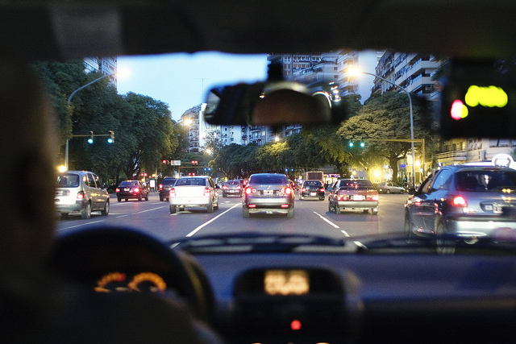
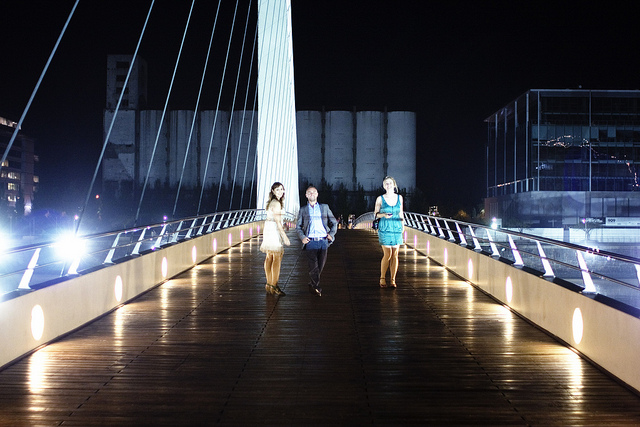

Six months ago I was sitting back in my apartment in Chilliwack trying to figure out where the first destination on my big adventure would take me. I immediately thought of the Caribbean, since it was an area I had been to many times and I was familiar with. Since the goal of my trip was to also work while exploring the world, that meant wherever I ended up would have to have decent access to the internet. That took Cuba off the list, as well as most small towns. I was actually homing in on the Dominican Republic when, out of boredom, I started thumbing through [The 4-Hour Workweek](/reviews/books/the-4-hour-workweek-review/), a popular book on vagabonding and extended vacations, once again.

In the book, Tim Ferris discusses his love of Argentina, and in particular, the City of Buenos Aires. Often described as “The Paris of South America”, Buenos Aires is a city that was once unaffordable for all but the richest of travellers. That all changed around the year 2000 when Argentina’s currency crashed violently, thrusting much of the country into poverty and making Argentina and the city of Buenos Aires extremely affordable for the rest of the world.

Streets Near Palermo

Given that I needed a place to go and that Tim highly recommended it, I made a rash decision – my first stop would be Buenos Aires, and I would embark on a three month visit to Argentina.

Why three months? Mainly because a lot of travel books I’ve read suggest three months is the minimum time to actually experience a new culture. Sure, you can bounce in and out of a new city in a few days and catch most of the highlights. But that’s not the culture, anymore than riding the tram to the top of Grouse Mountain would let you experience Vancouver culture.

I have to admit, I wasn’t that prepared for the culture shock that awaited me when I landed. Buenos Aires is really the first city I’ve ever been to where communicating was a real problem. I remember in particular the time I went to activate my cell phone, only to be at the front of a long line of tired and angry people, unable to communicate to the person in the booth that I needed to add minutes to my cell phone. After several minutes of trying, I eventually walked away in defeat and spent the rest of the night holed up at home wondering how long it would take before it would become easier.

Puerto Madero Skyscrapers

At that point I signed up for Spanish lessons, and did six hours a week for three weeks, enough to learn some basic vocabulary, my numbers, a handful of basic verbs, and three basic tenses. It was enough to give me a bit more confidence, and allow me to start exploring more. I still had quite a few setbacks over the course of three months, but I never had another defeat like I did that day in the cell phone line. I’ve also come to respect people who try to learn a new language a lot more, since it really is extremely challenging and requires dedication and hard work.

### Living in Buenos Aires

I rented an apartment in the area known as Palermo Soho, a trendy, upscale neighbourhood filled with bars and restaurants. Many of the streets are lined with huge trees, and at no time did I ever feel unsafe in the area. I was however surprised with the amount of graffiti in the area when I arrived, and the amount of establishments that had bars on their windows. After three months I eventually got used to it, but the area ended up being a bit more edgy than I imagined.

As advertised, there’s no end of nightlife in the Palermo area. Unlike North America where the bars shut down around 1 or 2am, most bars are open in Buenos Aires until the last patron leaves or 7am, whichever comes first. How Argentine people can go out until 7am and still somehow manage to work the next day is a mystery I never solved, but I saw the sunrise enough after a night of drinking to know that Argentine people can party pretty hard.

Japanese Gardens, Buenos Aires

One of the draws for me to Argentina was the devaluation of the Argentine Peso compared to the Canadian dollar. I’m sure back when the currency crashed Buenos Aires was a relative steal compared to much of North America, but I personally haven’t found the prices here to be that compelling, at least compared to what I imagined. Many of the other expats I met as well were surprised at how expensive things were in the city compared to what they envisioned as well. I suspect that’s a result of the massive amounts of inflation going on in Argentina (unofficial estimates place it at around 25% per year right now). When I arrived it cost $11 pesos to do a load of laundry, and just three months later it’s up to $13 pesos. Steaks that probably cost $25 pesos five years ago are more like $65 pesos now ($16 CAD) , which isn’t really that big of a discount from home, especially if you factor in what you get for that price.

### Food

I would never describe myself as a foodie, but I do appreciate good food. I had envisioned going out and eating great meals every second night or so for a fraction of what they would cost back home. But truthfully, I never really came to enjoy the food in Buenos Aires. There seems to be a real lack of variety and individuality amongst restaurants. In fact, almost every Argentine restaurant has the same items on the menu: pizza, pasta, steak and salads. And not only are the items the same, they are often prepared the same, which makes it very easy to get tired of eating out.

The Chivito, Famous Uruguay Sandwich

After getting bored with restaurants in Argentina, I decided to start cooking at home. Right away I realized that it’s basically impossible to find spices in any of the local supermarkets. You can find salt, a few prepackaged gravies, maybe some oregano, and that’s usually it. I only found one place in this city that carrier more spices, and it was a subway ride and a trek to a little place called El Gato Negro, a little coffee and spice shop downtown. I spent a few weeks trying to cook from home, and quickly gave up on making anything complicated due to the lack of ingredients that I’m used to.

If I had more time, I probably would have taken some Argentine cooking classes to try and learn how to cook like the locals do. But eventually I just starting eating snacks at home and most of my meals at little cafés and shops near my apartment.

Steak and Beer, Puerto Iguazu, Argentina

While many people I’ve met continue to point out how cheap the food in restaurants is compared to home, I don’t think it’s a fair comparison as most of the food back home is just far more likeable in my opinion. And that’s not just due to preference, there just seems to be less quality control than in the restaurant industry in North America. There were many times I was served a meal here that I was surprised the chef even let out of the kitchen. Often the meat was burnt, and other times I received cold food that was supposed to be hot. Once I ordered a pizza and it came on a piece of bread instead of a crust (it wasn’t meant to be that way, I think they just ran out and decided to cook whatever they had). I still ate and paid for it (I like bread, so why not!), but there’s not a lot of rhyme or reason in the restaurants down here. In fact, many times you’ll order the exact same item at the same restaurant and have it fairly different when it arrives. At least there’s never a dull moment eating out.

That’s not to say I didn’t have really good meals here, but there were pretty few and far between. And the meals I did enjoy generally ended up being 120 pesos or more, which is about $30 CAD. Those aren’t Mortons or Gotham prices, but it’s still a fair chunk of change to drop to get a decent meal.

### Crime

When you read about crime in Buenos Aires, there are no shortage of forum postings or first-person blog entries detailing just how scary this place can be. The cabbies will rip you off, you’ll probably get stabbed, and you’re likely to lose everything in your pockets on the subway.

Yes, I met an Irish guy who got robbed and stabbed in San Telmo late at night – but he was drunk and walking in areas he shouldn’t have been late at night. I also met a guy from Montreal who had two iPhones stolen on the subway – but he admitted he was careless. I never once had anything happen to me, or ever felt like I was in unsafe territory. In fact, the cab drivers that were supposedly going to rip me off actually helped me out. The camera I was supposed to have stolen at the bar only ended up taking photos of good, friendly people. And the Argentine people who were supposedly rude and moody welcomed me mostly with open arms. So you have to take what you read with a grain of salt.

If you do see crime though, almost all of it is opportunity theft – if you flaunt an expensive gadget in public, you may end up losing it. As a result most people keep expensive items in backpacks where they can’t be seen, or keep cell phones in their pockets in public places. But I think if you exercise a little caution this city is really no less safe than any major city in the world.

### People

Argentine people are passionate. They love soccer, they love tango, they love sipping coffee until the wee hours of the morning, and most importantly, they love each other. Family is important here, more so than other countries I’ve visited, and the love by adults for not just their children, but for all children, is quite moving. When I first starting working from coffee shops here I was surprised how many kids would run around the coffee shop and ‘bother’ other patrons. After three months though, it was hard not to smile while watching kids playing or trying to learn about whatever foreigner they happened to run into while bouncing between the chairs. Rare is it to see an adult not stop to smile at a kid playing, or to offer assistance for a mother and her baby.

Cabbing Through Buenos Aires

Many of my friends down here would describe Argentine people as moody or stand-offish. I’ve actually found many Argentines to be warm and welcoming, but it’s not hard to imagine why many of them are bitter: their beautiful country was thrust into poverty in the early 2000s, and many families were wiped out in the process. The once beautiful architecture is now covered in graffiti, and the cost of living is noticeably increasing on a monthly basis. But to their credit, most of them take it in stride, continuing to spend time with friends and family, and talking about better days over coffees until the wee hours of the morning.

### Argentina and Uruguay

When I originally planned my trip, I was going to spend most of my time in Buenos Aires, and venture out to Rio De Janeiro as well as Machu Pachu. I actually did neither, and instead spent most of my time exploring Argentina and the neighbouring Uruguay.

My first trip was to Montevideo in Uruguay which involved a three hour ferry ride from Buenos Aires across the Rio de la Plata. It was a quick trip, but it allowed me to sample the famous chivito sandwich (probably the best sandwich I’ve ever tasted) and also to see some of the amazing architecture in the city.

Montevideo, Uruguay

My second trip was to Iguazu Falls, once of the most impressive natural wonders in the world. If you’re ever in South America, it would be an absolute shame to miss out on seeing the falls, as they are really quite remarkable. I also had a really great time exploring Puerto Iguazu, a little town about 20 minutes from the falls that reminded me of Tofino in British Columbia.

Iguazu Falls, Argentina

And lastly, I took a trip to the end of the world, Ushuaia, Argentina, also known as the southern most city in the world. It was here that I explored the Beagle Channel on a sailboat, drank Irish beer in the southern most Irish pub in the world on St. Patties Day, and spent an afternoon with three different species of penguins, which is probably my most memorable experience from my three month adventure here.

Gentoo Penguin near Ushuaia, Argentina

### Final Thoughts

Other than a three month stint working in the Yukon when I was 20 and two years I spent in Ottawa, my three months in Argentina is the longest period of time I’ve ever spent away from the Vancouver area. Often it was spectacular. Sometimes it was frustrating. And once and a while it was lonely. It’s not too hard to meet expats, and I met the occasional local person, but most of the people you meet on the road are on their way somewhere else. You spend time making friends only to watch them leave shortly after. Some days you can’t wait to get out and meet new and interesting people, but on others you wake up and miss your friends from back home.

Friends of mine, Puerto Madero, Buenos Aires

I also spent a lot of time walking around late at night listening to music and reflecting on daily life. I didn’t keep track, but I would have lost track long ago how many times I did a late night walk around Palermo, or how many cups of coffee I had while just sitting and watching the traffic. I met great people, had great conversations, and spent many afternoons just walking around and enjoying the Architecture.

Tierra Del Fuego, Argentina

And in many ways, that’s the Buenos Aires experience. It’s a city of late nights, of friends, of laughter, and of Argentine passion. It’s a city filled with great architecture and great people, nestled in a country that places more value on each other than on big screen TVs or iPods. And while covered in a few layers of dust, it’s not hard to see the beauty beneath, an elegance that once was and will most assuredly be once again.