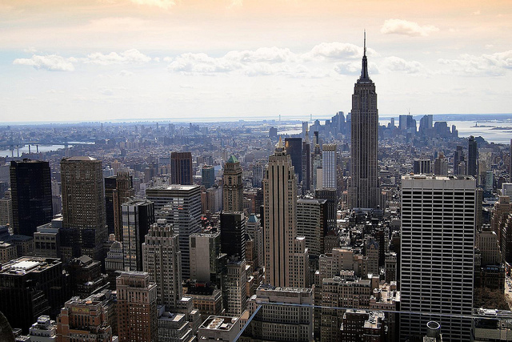
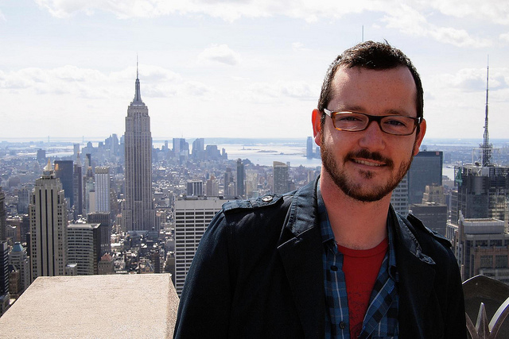
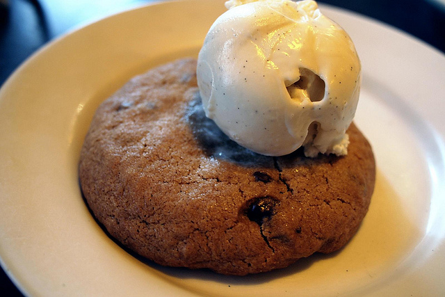
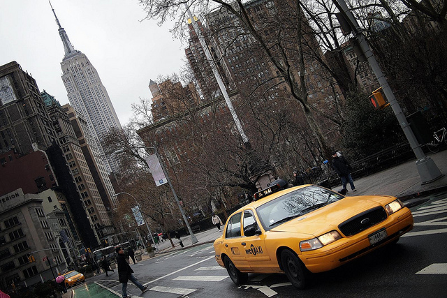

As of yesterday, I am no longer the owner of a SLR camera. I purchased my first SLR back in 2004, so I’ve been a SLR user for almost 7 years. And while I love the quality of photos you can take with a SLR camera, dragging tons of equipment and lenses around gets a bit tiring. That’s even more true when you start picking up some of the nicer, heavier lenses, many of which I owned previously.

I sold all my L-series glass about 6 months ago, partially because they weren’t being used and also because I needed the cash to finance some of my current traveling adventures. I wasn’t originally going to bring a SLR camera with me, but decided at the last minute to bring my 40D and a 28mm prime lens. It’s not a bad combo, but it still takes up quite a bit of room in a backpack.

I decided down in Argentina that the SLR wasn’t really working for me, so decided I would do something different as soon as I hit North America again. I arrived in New York City two days ago, and promptly went out and purchased the Olympus E-PL2 micro four thirds camera. I sold my 28mm lens here for $400 USD on craigslist, and my SLR body + battery pack for $450 USD. The E-PL2 cost me around $600 USD, and the 20mm f/1.7 Lumix lens was another $400. So for a difference of $150 I replaced my SLR system with a micro four thirds system that’s lighter and more flexible, at least in the short term. I’ll probably pick up a full frame Nikon SLR at some point in the future, but until then I’m going to try going micro four thirds exclusively.

I’ll review it more when I have some more time, but I thought I’d attach a few photo that I’ve taken with it.

Yankee Stadium

Yankee Stadium

Empire State Building

Dale, Top of the Rock

Cookie and Ice Cream, 20mm

New York Cab