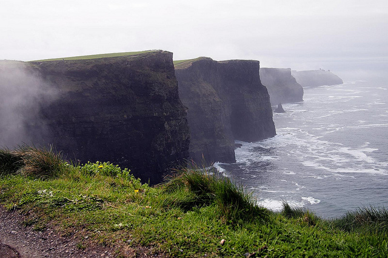

I left South America a few weeks ago, and have since been to New York City and a great deal of Ireland.

Ireland was quite the whirlwind adventure. I spent the first night in Limerick at my friend Andy’s place, and then the next day we did a road trip up to Galway. The day after we headed down to Cork, and made a quick pitstop to kiss the original Blarney Stone. The next two nights we stayed at little 200 year old cottage in Mitchellstown. All in all a great adventure. I flew to Edinburgh, Scotland Monday morning, and am currently sitting in a hotel.

Cliffs of Moher, Ireland

I haven’t had time to go take my photos yet, but I can say that Edinburgh is an amazing city. I was walking up a road last night to a pub and the entire scenery reminded me of Minus Tirith from Lord of the Rings. I still seems strange eating a meal or drinking a beer when you can see old castles in the background and remnants from ages long since past.

Another aspect of Edinburgh I really like is that it’s also a fairly clean and modern city. You can find great food, good coffee shops, lots of great shopping and tons of night life. It’s one of the few cities I’ve been to where I honestly feel like I could spend quite a bit of time there.

On Friday I’ll be flying out for Dublin, where I’ll be meeting my friend Tanya for a few days in that city. Sunday night we’re both flying to London, and will be spending a few days there.

From there, I’m actually going to be heading back to Vancouver for a while.

I was originally going to head to Paris after London, but about a month ago I was starting to feel pretty drained from traveling all the time. While it’s been a great adventure, being on the road for nearly four months makes you miss a lot of the comforts from home (I can count on one hand the number of home cooked meals I’ve probably had since leaving in January). I actually miss cooking, and sitting on the couch on a rainy Sunday and watching movies. I also have a few things that I need to take care of back home, such as my personal taxes and a few other business related items. So I just decided that it would be good to visit home again for a while.

Given that it’s spring back home and that camping season is right around the corner, I’m planning on staying for a few months and catching up with everyone. I already have accommodation lined up with a friend out near Vancouver, so I’ll be sorting that out when I’m back.

My plan at this point is to leave the majority of my stuff in storage, and probably visit a few more places later in the summer or the fall. If I can swing it, I may head back to Europe later in the summer and do a bit more exploring. Outside of that, I’ll probably rent a place in New Zealand in the fall for a month or two, similar to what I did in Buenos Aires.

So, Edinburgh for two more days, Dublin, London and then a flight back to Vancouver from Gatwick next Thursday. I’m definitely looking forward to seeing BC again, and of course all my friends and family. I have tickets to Northern Voice as well, so I’m looking forward to seeing a lot of people there.