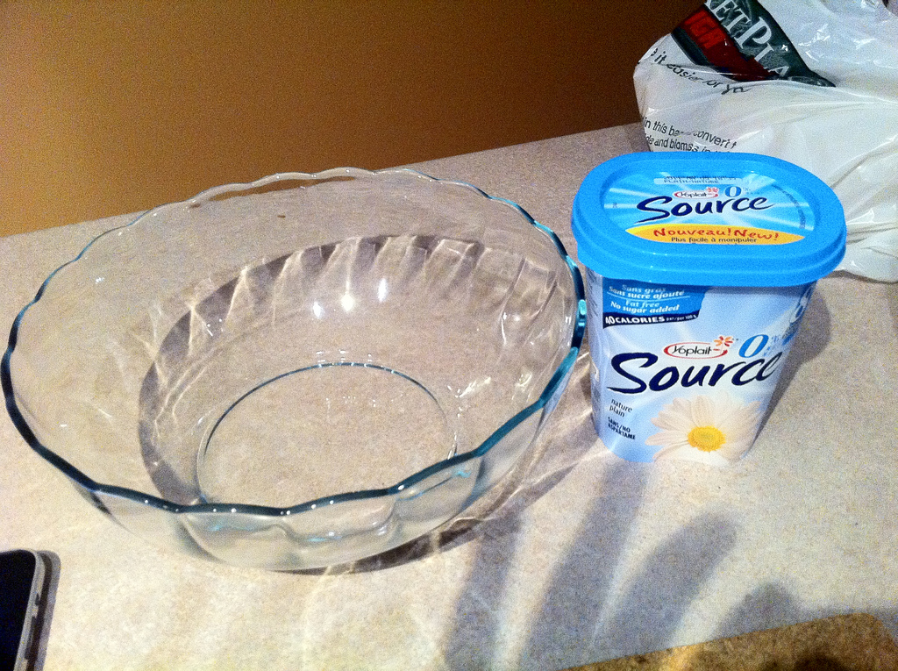
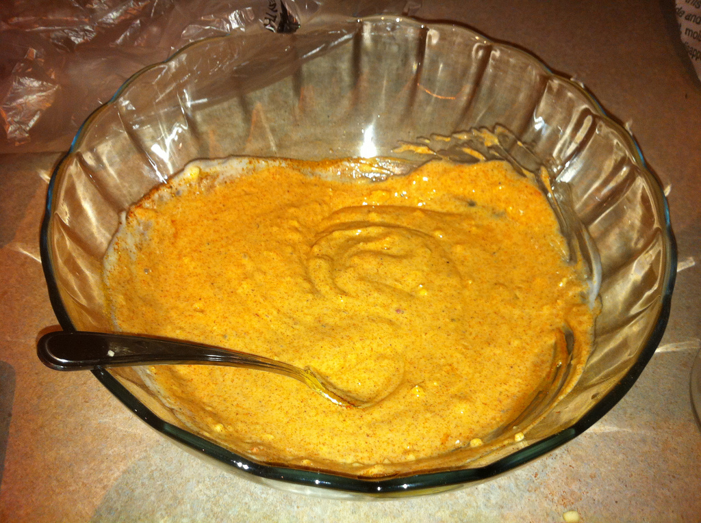
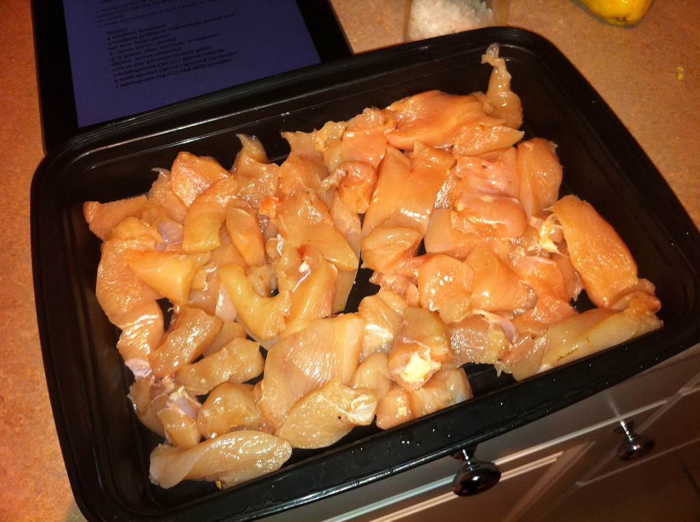
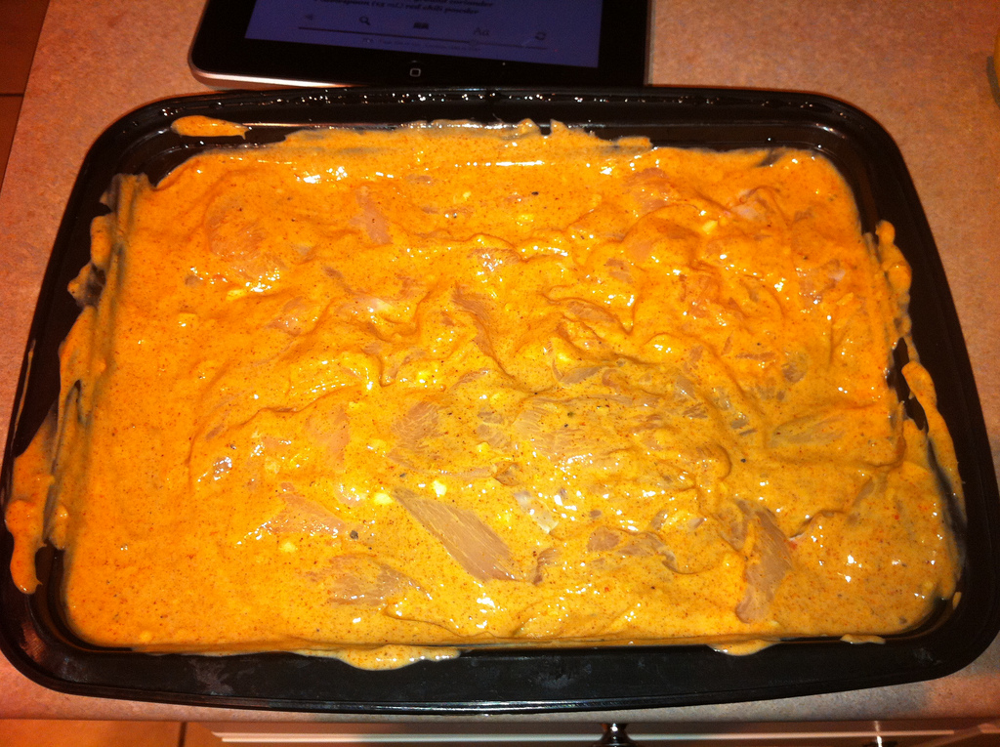
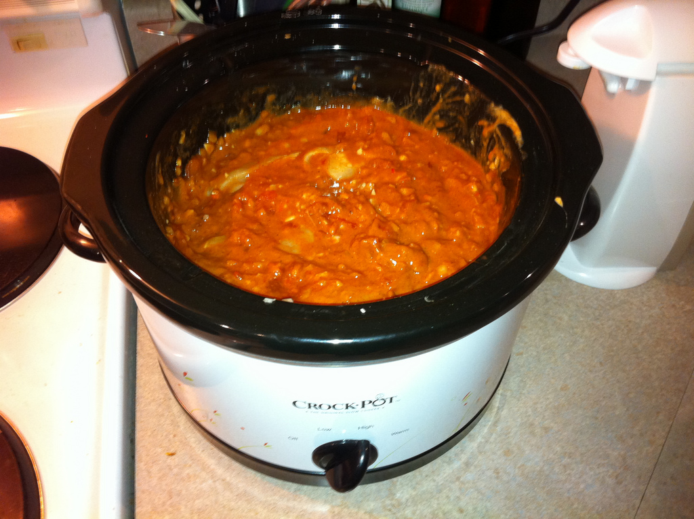
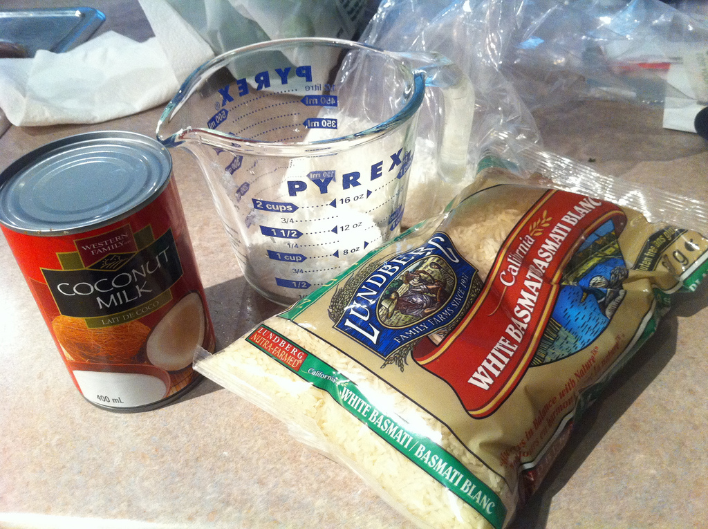

I’ve been itching lately to try cooking some Indian cuisine, and have devoured a few cookbooks on the subject. The cookbook that appeals to me the most includes recipes that entail slow cooking most of the popular Indian dishes, so that’s what I’ve decided to start with.

The name of the book (if anyone is interested) is [The Indian Slow Cooker: 50 Healthy, Easy, Authentic Recipes](http://www.amazon.com/gp/product/1572841117/ref=as_li_qf_sp_asin_il_tl?ie=UTF8&tag=duanstor-20&linkCode=as2&camp=1789&creative=9325&creativeASIN=1572841117).

Why Indian? That’s a good question. Probably the best answer is that I really have no idea how to make any of the dishes, so it seems like a fun venture for a few weeks. I also recently spent three months in Argentina where it’s pretty rare to find a spicy dish to eat, so I’m anxious to get back to eating some spicy foods. So, Indian it is.

The first dish I decided to make is Chicken Tikka Masala with Coconut Basmati Rice. Chicken Masala is a popular dish in the UK, so much so that it’s part of their national cuisine. Given that I’ve had it a few times, it seemed like as good a dish as any to start with.

## Chicken Tikka

The first step in preparing the dish is to marinate the chicken in a yogurt and spice mixture. Most recipes call for a minimum of two hours, but I’m going the distance and marinating my chicken overnight.

Low Carb Yogurt

I’m not big on carbohydrates, so whenever possible I try and remove empty carbs from any dishes I make at home. Most yogurt is full of sugar, so I tend to stay away from it. The yogurt pictured above actually doesn’t contain any added sugar, so it’s the one I decided to use.

Here’s a rough list of ingredients for the marinade:

- 2 Cups Plain Yogurt
- 3 Tablespoons of Lemon Juice
- 1 Piece of Ginger, Peeled and Grated
- 3 Cloves of Garlic
- 1 Tablespoon of Red Chilli Powder
- 1 Tablespoon of Paprika
- 2 Teaspoons of Ground Cinnamon
- 2 Teaspoons of Black Pepper
- 2 Teaspoons of Salt
- 3 Pounds of Boneless, Skinless Chicken
- Optional (from another recipe) 1/2 – 1 Teaspoon of Cayenne Pepper

Yogurt and Spice Marinade for Chicken Tikka Masala

Once you combine everything above, you essentially have your yogurt marinade for the chicken. All that’s left to do is cut up your boneless, skinless chicken and put it in a container to be marinated overnight.

Chicken, Waiting for some Marinade Love

And the finished product, ready to go in the fridge overnight.

Chicken Tikka Masala, Marinating Overnight

## Masala

I let the chicken marinate in the fridge overnight, and boy oh boy did it smell good when I opened it! The next step was to create the masala mixture. Here’s the recipe I used.

- 6 Medium Tomatoes
- 3 Medium Yellow Onions
- 6 Cloves of Garlic
- 4-6 Thai Chilies
- 2 6-oz Cans of Tomato Paste
- 2 Tablespoons of Garam Masala
- 2 Tablespoons of Ground Coriander
- 1 Tablespoon of Red Chilli Pepper
- 1 Tablespoon of Salt
- 1 Tablespoon of Brown Sugar
- 3 Tablespoons of Blanched, Sliced Almonds
- 1 Teaspoon of Ground Cinnamon
- 1/2 Cup of Water
- 6 Cardamom Pods, Crusted Slightly in a Mortar

The tomatoes in the grocery store looked pretty ghetto, so I just grabbed a can of diced tomatoes instead. The instructions say that you’re supposed to puree everything but the tomatoes in a food processor, but since mine is sitting in a box back in Chilliwack I decided to just improvise by chopping everything as fine as I could get it. It’s not ideal, but in conjunction with six hours of slow cooking I’m hoping it becomes fairly mushtastic™.

Chicken Tikka Masala, Ready To Slow Cook

I combined the marinated chicken with the masala, put it all in the slow cooker, and set the dial to high. It needs to cook for between six and eight hours, at which point it’ll be time to rock the coconut basmati rice.

## Coconut Basmati Rice

The rice that most indian dishes call for is basmati rice, which generally has longer grains than most other rices. In addition, it also has a lower glycemic load, which makes it marginally healthier than other rices as well.

Ingredients for Coconut Basmati Rice

Coconut rice isn’t really that much different than normal rice, especially if you have a rice cooker. Here are the ingredients:

- 5 Cups of Basmati Rice
- 1 Cup of Coconut Milk
- 1/4 Cup of Sweetened Coconut Flakes
- Water to top off Rice Cooker

Simply turn the rice cooker on and let it do its magic.

To be continued…