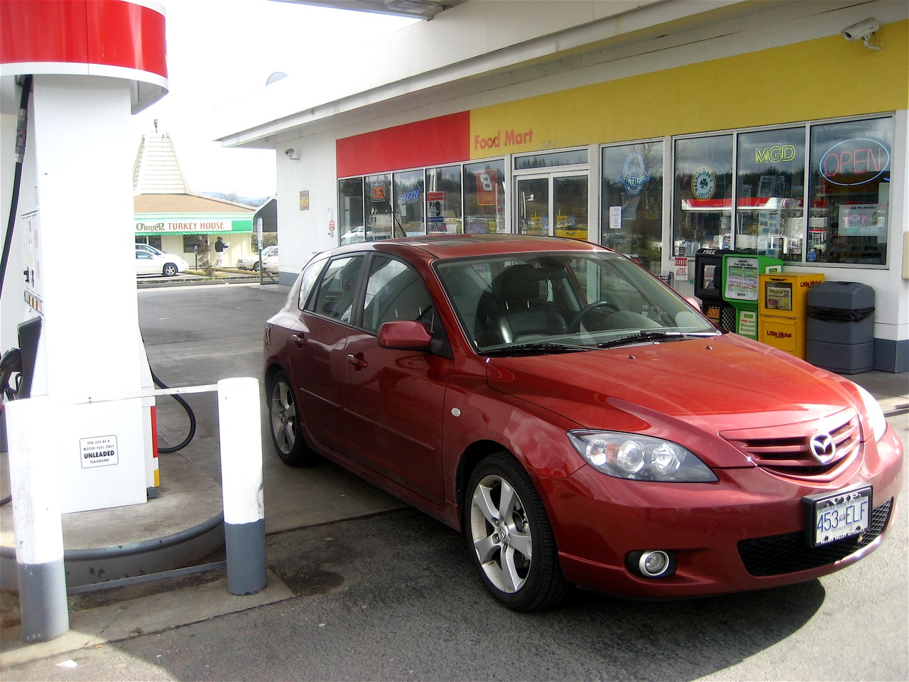

I remember taking a summer off from UBC one year and heading back to Chilliwack. At the time gas was sitting at around 39 cents per litre. It’s hard to imagine that it’s only been around ten years since then and gas is now hovering at around 140 cents a litre in the Vancouver area. To put that into context, the $60 I spend filling up my car would have cost around $16 back then.

In fact, now that I’m back in the Vancouver area, it’s not lost on me just how expensive it is to own and operate a car. I have a 2006 Mazda 3 Sport that I own outright. My insurance runs me around $135 a month through ICBC, and I’m probably on track to spend at least $200 this month on gas. So that’s $335 in just gas and insurance. To properly account for the cost of the car, depreciation should also be taken into account. I’m going to ballpark around $2,000 worth of depreciation this year, which works out to around $166 a month. If you add it all up, my car is costing me around $500 per month. Ouch.

I’ve actually started thinking about getting rid of my Mazda 3 and possibly getting a Volkswagon Jetta TDI with the diesel engine, since it gets around 50 miles per gallon I believe. I’d have to do the math to figure out what the break even cost would be, but given that it has almost double the gas milage of my current car, it would at least save me $1,000 a year in gas costs.

But, not all is lost. If the gas pump has you singing the blues as well there are a few things you can do.

First, get rid of all the crap you carry around but never use. The heavier the car is the more gas it takes to move it around. So empty everything out that you don’t need. I opened my trunk this morning and found a pile of heavy stuff that I really don’t need to carry around. I’m sure most people have cars that are the same.

Next, head down to the gas station and make sure your tires are properly inflated. Not only will properly inflated tires increase your gas milage, but you’ll actually notice the difference in how your car handles.

Even better, leave the car at home and rollerblade, bike or walk if that’s an option. Based on current economic conditions here and in the United States, I expect gas to only continue to go up. So, I think it’s going to get worse before it gets better, if it ever does.