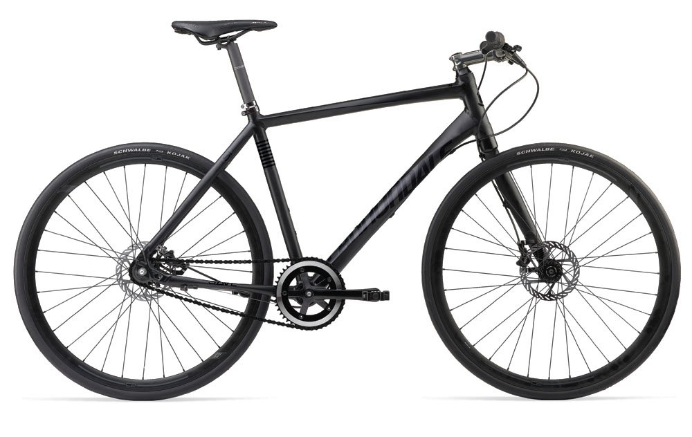

Between the ages of 17 and about 21 or so I was actually pretty big into biking. I used to have a Specialized mountain bike, and would hit the trails on the weekends or ride around Chilliwack with my friends. Unfortunately that bike got stolen one day when I accidentally left the garage door open overnight, and I didn’t have money to replace it at the time.

About five years ago I decided to pick up a bike in Vancouver, and ended up getting a cheap $150 hybrid just to try and get some exercise. I’m not sure if it was because it was pretty much a piece of garbage or the fact that it wasn’t really adjusted for my body, but it was like dragging a tank through the streets and I basically never rode it. When I moved to Chilliwack from Vancouver I gave it to my mom. Whether or not she has actually ridden it is still a mystery.

I decided a few months ago that there were two purchases I wanted to make this summer. The first was a nice guitar, [and I did that the other day](/2011/new-morgan-concert-series-guitar/). The second purchase is a new bike.

I’ve spent the last week looking at bikes online and went to a few shops on the weekend to try a few out. I was mainly looking at Cannondale and Trek bikes, since I’m familiar with both of those brands. At first I was considering a road bike, but since I enjoy hitting the odd light trail, it’s not really a great fit for me right now. In addition, I’ve never owned a road bike, so I didn’t want to spend any significant amount of money on a bike I’m not entirely sure I’d enjoy.

That said, I had a nice mountain bike years ago and based on my experience with a cheaper bike, didn’t really want to go down that route again. As a result I was looking at around the $1,000 price point, which is where bikes start having nicer components and lighter frames. In the hybrid category I had narrowed it down to the Cannondale Bad Boy Solo and the Trek 7.5 FX.

I swung by the store at lunch out here in Port Coquitlam and took both for a quick spin. Ultimately I ended up liking the Cannondale Bad Boy more than the Trek, so the store did a quick fit for me and I took that bad boy home. Since it was last year’s model I ended up saving a few hundred dollars on a bike that actually has nice components, at least for an entry bike into biking.

Cannondale Bad Boy Solo

In terms of components, it has a [Shimano Deore](http://www.shimano.com/publish/content/global_cycle/en/us/index/products/mountain/deore.html) set, which is basically part of Shimanos mid-level range (a noticeable step up from their entry-level line). The bike also comes equipped with disc breaks, which is a nice add-on as well.

Part of the reason I ended up liking the bike is that it reminded me a lot of how my old specialized bike used to feel. Undoubtedly there’s a bit of nostalgia in my decision, but I still think it’s the right one for me. While the bike is primarily set up for road travel, the frame and tires can easily handle packed trails, which is all I see myself going on in the near future.

So, as soon as there’s a break in the clouds, I plan to get out and start riding. Once I get some better clothing I’ll venture out even in the rain, but for the first few rides I’m going to wait until it’s dry so I can get a feel for how it handles in a few different types of conditions. I also installed the RunKeeper app on my iPhone, so I’m looking forward to tracking my progress that way. Once I bank a bit more money I’ll likely install a hitch in my car and get a hitch-mount bike rack so I can take it places with friends. As it is, I can fit my bike in the back of my car thanks to having a hatchback, so there’s no real rush there.

To compliment this bike I also picked up a [Swagman XTC Cross Country 2-Bike Hitch Mount Rack](/travel/reviews/products/swagman-xtc-cross-country-2-bike-hitch-mount-rack-review/) for my Mazda 3 Sport, as well as a [iPhone Bike Mount](/travel/reviews/products/ram-iphone-bike-mount-review/) so I can mount my iPhone while biking around.